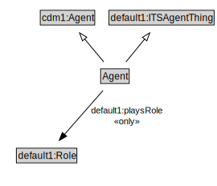

# Agent

<a href="diagrams/Agent.dot.svg">Open interactive Agent diagram</a>

## Formalization for Agent

| Property | Constraint |
|----------|------------|
| default1:playsRole | all default1:Role |
| subClassOf | default1:ITSAgentThing |
| subClassOf | cdm1:Agent |

