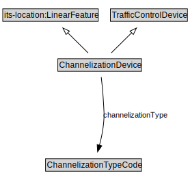

# ChannelizationDevice

<a href="diagrams/ChannelizationDevice.dot.svg">Open interactive ChannelizationDevice diagram</a>

## Formalization for ChannelizationDevice

| Property | Constraint |
|----------|------------|
| subClassOf | TrafficControlDevice |

## Other annotations

| Property | Value |
|----------|-------|
| xsd:pattern | TroPattern |

