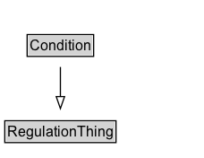

# Condition

## Diagram

=== "SVG (interactive)"

    <!-- Generated by graphviz version 14.0.2 (20251019.1705)
     -->
    <!-- Pages: 1 -->
    <svg width="171pt" height="132pt"
     viewBox="0.00 0.00 171.00 132.00" xmlns="http://www.w3.org/2000/svg" xmlns:xlink="http://www.w3.org/1999/xlink">
    <g id="graph0" class="graph" transform="scale(1 1) rotate(0) translate(4 128)">
    <polygon fill="white" stroke="none" points="-4,4 -4,-128 166.62,-128 166.62,4 -4,4"/>
    <g id="clust2" class="cluster">
    <title>cluster_associated</title>
    </g>
    <!-- Condition -->
    <g id="node1" class="node">
    <title>Condition</title>
    <g id="a_node1"><a xlink:href="../Condition" xlink:title="&lt;TABLE&gt;">
    <polygon fill="lightgray" stroke="none" points="19.75,-81.88 19.75,-98.12 73.5,-98.12 73.5,-81.88 19.75,-81.88"/>
    <text xml:space="preserve" text-anchor="start" x="20.75" y="-85.72" font-family="Arial" font-size="12.00">Condition</text>
    <polygon fill="none" stroke="black" points="18.75,-80.88 18.75,-99.12 74.5,-99.12 74.5,-80.88 18.75,-80.88"/>
    </a>
    </g>
    </g>
    <!-- RegulationThing -->
    <g id="node3" class="node">
    <title>RegulationThing</title>
    <g id="a_node3"><a xlink:href="../RegulationThing" xlink:title="&lt;TABLE&gt;">
    <polygon fill="lightgray" stroke="none" points="1,-9.88 1,-26.12 92.25,-26.12 92.25,-9.88 1,-9.88"/>
    <text xml:space="preserve" text-anchor="start" x="2" y="-13.72" font-family="Arial" font-size="12.00">RegulationThing</text>
    <polygon fill="none" stroke="black" points="0,-8.88 0,-27.12 93.25,-27.12 93.25,-8.88 0,-8.88"/>
    </a>
    </g>
    </g>
    <!-- Condition&#45;&gt;RegulationThing -->
    <g id="edge1" class="edge">
    <title>Condition&#45;&gt;RegulationThing</title>
    <path fill="none" stroke="black" d="M46.62,-72.05C46.62,-64.57 46.62,-55.58 46.62,-47.14"/>
    <polygon fill="none" stroke="black" points="50.13,-47.3 46.63,-37.3 43.13,-47.3 50.13,-47.3"/>
    </g>
    <!-- Invis -->
    </g>
    </svg>

=== "PNG"

    

## Formalization for Condition

| Property | Constraint |
|----------|------------|
| subClassOf | [RegulationThing](RegulationThing.md) |

