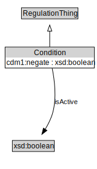

# Condition

<a href="diagrams/Condition.dot.svg">Open interactive Condition diagram</a>

## Formalization for Condition

| Property | Constraint |
|----------|------------|
| subClassOf | RegulationThing |

