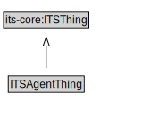

# ITSAgentThing

<a href="diagrams/ITSAgentThing.dot.svg">Open interactive ITSAgentThing diagram</a>

## Specializations of ITSAgentThing

| Class | Description |
|-------|-------------|
| [Rule Maker Role](RuleMakerRole.md) |  |

## Formalization for ITSAgentThing

| Property | Constraint |
|----------|------------|
| subClassOf | its-core:ITSThing |

