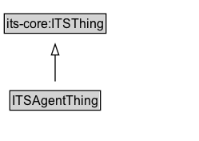

# ITSAgentThing

## Diagram

=== "SVG (interactive)"

    <!-- Generated by graphviz version 14.0.2 (20251019.1705)
     -->
    <!-- Pages: 1 -->
    <svg width="187pt" height="132pt"
     viewBox="0.00 0.00 187.00 132.00" xmlns="http://www.w3.org/2000/svg" xmlns:xlink="http://www.w3.org/1999/xlink">
    <g id="graph0" class="graph" transform="scale(1 1) rotate(0) translate(4 128)">
    <polygon fill="white" stroke="none" points="-4,4 -4,-128 182.75,-128 182.75,4 -4,4"/>
    <g id="clust2" class="cluster">
    <title>cluster_associated</title>
    </g>
    <!-- ITSAgentThing -->
    <g id="node1" class="node">
    <title>ITSAgentThing</title>
    <g id="a_node1"><a xlink:href="../ITSAgentThing" xlink:title="&lt;TABLE&gt;">
    <polygon fill="lightgray" stroke="none" points="6.25,-25.88 6.25,-42.12 89.25,-42.12 89.25,-25.88 6.25,-25.88"/>
    <text xml:space="preserve" text-anchor="start" x="7.25" y="-29.73" font-family="Arial" font-size="12.00">ITSAgentThing</text>
    <polygon fill="none" stroke="black" points="5.25,-24.88 5.25,-43.12 90.25,-43.12 90.25,-24.88 5.25,-24.88"/>
    </a>
    </g>
    </g>
    <!-- its&#45;core_ITSThing -->
    <g id="node3" class="node">
    <title>its&#45;core_ITSThing</title>
    <polygon fill="lightgray" stroke="none" points="1,-97.88 1,-114.12 94.5,-114.12 94.5,-97.88 1,-97.88"/>
    <text xml:space="preserve" text-anchor="start" x="2" y="-101.72" font-family="Arial" font-size="12.00">its&#45;core:ITSThing</text>
    <polygon fill="none" stroke="black" points="0,-96.88 0,-115.12 95.5,-115.12 95.5,-96.88 0,-96.88"/>
    </g>
    <!-- ITSAgentThing&#45;&gt;its&#45;core_ITSThing -->
    <g id="edge1" class="edge">
    <title>ITSAgentThing&#45;&gt;its&#45;core_ITSThing</title>
    <path fill="none" stroke="black" d="M47.75,-51.79C47.75,-59.25 47.75,-68.24 47.75,-76.69"/>
    <polygon fill="none" stroke="black" points="44.25,-76.54 47.75,-86.54 51.25,-76.54 44.25,-76.54"/>
    </g>
    <!-- Invis -->
    </g>
    </svg>

=== "PNG"

    

## Specializations of ITSAgentThing

| Class | Description |
|-------|-------------|
| [Rule Maker Role](RuleMakerRole.md) |  |

## Formalization for ITSAgentThing

| Property | Constraint |
|----------|------------|
| subClassOf | its-core:ITSThing |

