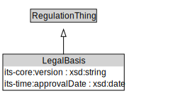

# LegalBasis

<a href="diagrams/LegalBasis.dot.svg">Open interactive LegalBasis diagram</a>

## Formalization for LegalBasis

| Property | Constraint |
|----------|------------|
| cdm1:hasName | min 1 owl:Thing |
| its-core:version | max 1 owl:Thing |
| its-time:approvalDate | max 1 owl:Thing |
| subClassOf | RegulationThing |

