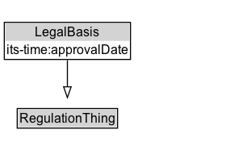

# LegalBasis

## Diagram

=== "SVG (interactive)"

    <!-- Generated by graphviz version 14.0.2 (20251019.1705)
     -->
    <!-- Pages: 1 -->
    <svg width="214pt" height="132pt"
     viewBox="0.00 0.00 214.00 132.00" xmlns="http://www.w3.org/2000/svg" xmlns:xlink="http://www.w3.org/1999/xlink">
    <g id="graph0" class="graph" transform="scale(1 1) rotate(0) translate(4 128)">
    <polygon fill="white" stroke="none" points="-4,4 -4,-128 209.62,-128 209.62,4 -4,4"/>
    <g id="clust2" class="cluster">
    <title>cluster_associated</title>
    </g>
    <!-- LegalBasis -->
    <g id="node1" class="node">
    <title>LegalBasis</title>
    <g id="a_node1"><a xlink:href="../LegalBasis" xlink:title="&lt;TABLE&gt;">
    <polygon fill="lightgray" stroke="none" points="1,-90 1,-106.25 116.25,-106.25 116.25,-90 1,-90"/>
    <text xml:space="preserve" text-anchor="start" x="28.62" y="-93.85" font-family="Arial" font-size="12.00">LegalBasis</text>
    <text xml:space="preserve" text-anchor="start" x="2" y="-77.6" font-family="Arial" font-size="12.00">its&#45;time:approvalDate</text>
    <polygon fill="none" stroke="black" points="0,-72.75 0,-107.25 117.25,-107.25 117.25,-72.75 0,-72.75"/>
    </a>
    </g>
    </g>
    <!-- RegulationThing -->
    <g id="node3" class="node">
    <title>RegulationThing</title>
    <g id="a_node3"><a xlink:href="../RegulationThing" xlink:title="&lt;TABLE&gt;">
    <polygon fill="lightgray" stroke="none" points="13,-9.88 13,-26.12 104.25,-26.12 104.25,-9.88 13,-9.88"/>
    <text xml:space="preserve" text-anchor="start" x="14" y="-13.72" font-family="Arial" font-size="12.00">RegulationThing</text>
    <polygon fill="none" stroke="black" points="12,-8.88 12,-27.12 105.25,-27.12 105.25,-8.88 12,-8.88"/>
    </a>
    </g>
    </g>
    <!-- LegalBasis&#45;&gt;RegulationThing -->
    <g id="edge1" class="edge">
    <title>LegalBasis&#45;&gt;RegulationThing</title>
    <path fill="none" stroke="black" d="M58.62,-72.05C58.62,-64.57 58.62,-55.58 58.62,-47.14"/>
    <polygon fill="none" stroke="black" points="62.13,-47.3 58.63,-37.3 55.13,-47.3 62.13,-47.3"/>
    </g>
    <!-- Invis -->
    </g>
    </svg>

=== "PNG"

    

## Formalization for LegalBasis

| Property | Constraint |
|----------|------------|
| [cdm1:hasName](https://w3id.org/citydata/part1/v1/hasName) | min 1 |
| [its-core:version](https://w3id.org/itsdata/core/v1/version) | max 1 |
| [its-time:approvalDate](https://w3id.org/itsdata/time/v1/approvalDate) | max 1 |
| subClassOf | [RegulationThing](RegulationThing.md) |

