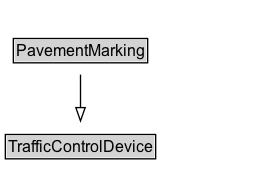

# PavementMarking

## Diagram

=== "SVG (interactive)"

    <!-- Generated by graphviz version 14.0.2 (20251019.1705)
     -->
    <!-- Pages: 1 -->
    <svg width="202pt" height="132pt"
     viewBox="0.00 0.00 202.00 132.00" xmlns="http://www.w3.org/2000/svg" xmlns:xlink="http://www.w3.org/1999/xlink">
    <g id="graph0" class="graph" transform="scale(1 1) rotate(0) translate(4 128)">
    <polygon fill="white" stroke="none" points="-4,4 -4,-128 198.38,-128 198.38,4 -4,4"/>
    <g id="clust2" class="cluster">
    <title>cluster_associated</title>
    </g>
    <!-- PavementMarking -->
    <g id="node1" class="node">
    <title>PavementMarking</title>
    <g id="a_node1"><a xlink:href="../PavementMarking" xlink:title="&lt;TABLE&gt;">
    <polygon fill="lightgray" stroke="none" points="7,-81.88 7,-98.12 105.75,-98.12 105.75,-81.88 7,-81.88"/>
    <text xml:space="preserve" text-anchor="start" x="8" y="-85.72" font-family="Arial" font-size="12.00">PavementMarking</text>
    <polygon fill="none" stroke="black" points="6,-80.88 6,-99.12 106.75,-99.12 106.75,-80.88 6,-80.88"/>
    </a>
    </g>
    </g>
    <!-- TrafficControlDevice -->
    <g id="node3" class="node">
    <title>TrafficControlDevice</title>
    <g id="a_node3"><a xlink:href="../TrafficControlDevice" xlink:title="&lt;TABLE&gt;">
    <polygon fill="lightgray" stroke="none" points="1,-9.88 1,-26.12 111.75,-26.12 111.75,-9.88 1,-9.88"/>
    <text xml:space="preserve" text-anchor="start" x="2" y="-13.72" font-family="Arial" font-size="12.00">TrafficControlDevice</text>
    <polygon fill="none" stroke="black" points="0,-8.88 0,-27.12 112.75,-27.12 112.75,-8.88 0,-8.88"/>
    </a>
    </g>
    </g>
    <!-- PavementMarking&#45;&gt;TrafficControlDevice -->
    <g id="edge1" class="edge">
    <title>PavementMarking&#45;&gt;TrafficControlDevice</title>
    <path fill="none" stroke="black" d="M56.38,-72.05C56.38,-64.57 56.38,-55.58 56.38,-47.14"/>
    <polygon fill="none" stroke="black" points="59.88,-47.3 56.38,-37.3 52.88,-47.3 59.88,-47.3"/>
    </g>
    <!-- Invis -->
    </g>
    </svg>

=== "PNG"

    

## Formalization for PavementMarking

| Property | Constraint |
|----------|------------|
| subClassOf | [TrafficControlDevice](TrafficControlDevice.md) |

## Other annotations

| Property | Value |
|----------|-------|
| [xsd:pattern](https://w3id.org/citydata/imported/xsd/pattern) | TroPattern |

