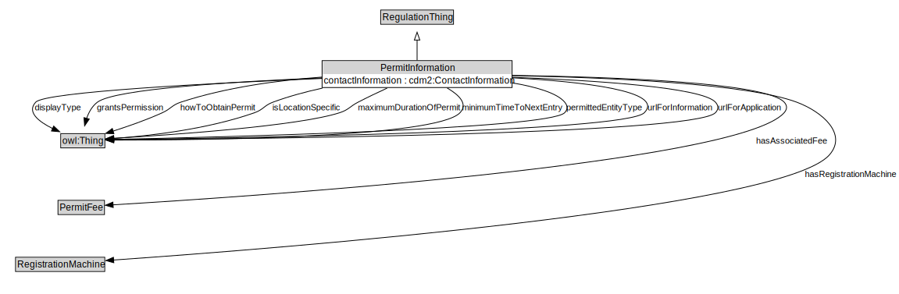

# PermitInformation

EXAMPLE: If a parking permit is required for a specific area, this class would contain details about that permit, such as how to obtain and what other permits are acceptable.

<a href="diagrams/PermitInformation.dot.svg">Open interactive PermitInformation diagram</a>

## Formalization for PermitInformation

| Property | Constraint |
|----------|------------|
| subClassOf | RegulationThing |

## Used by classes

| Class | Property |
|-------|----------|
| [Traffic Regulation](TrafficRegulation.md) | permitInformation |

