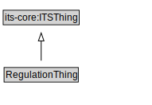

# RegulationThing

<a href="diagrams/RegulationThing.dot.svg">Open interactive RegulationThing diagram</a>

## Specializations of RegulationThing

| Class | Description |
|-------|-------------|
| [Access Control Device](AccessControlDevice.md) |  |
| [Channelization Device](ChannelizationDevice.md) |  |
| [Condition](Condition.md) |  |
| [Legal Basis](LegalBasis.md) |  |
| [Pavement Marking](PavementMarking.md) |  |
| [Permit Information](PermitInformation.md) |  |
| [Road Sign](RoadSign.md) |  |
| [Road Surface Feature](RoadSurfaceFeature.md) |  |
| [Rule Maker Role](RuleMakerRole.md) |  |
| [Traffic Control Device](TrafficControlDevice.md) |  |
| [Traffic Regulation](TrafficRegulation.md) |  |
| [Traffic Regulation Order](TrafficRegulationOrder.md) |  |
| [Traffic Signal](TrafficSignal.md) |  |
| [Traffic Signal Device](TrafficSignalDevice.md) |  |
| [Type Of Regulation](TypeOfRegulation.md) |  |
| [Warning Beacon](WarningBeacon.md) |  |

## Formalization for RegulationThing

| Property | Constraint |
|----------|------------|
| subClassOf | its-core:ITSThing |

