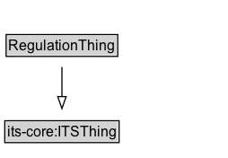

# RegulationThing

## Diagram

=== "SVG (interactive)"

    <!-- Generated by graphviz version 14.0.2 (20251019.1705)
     -->
    <!-- Pages: 1 -->
    <svg width="191pt" height="132pt"
     viewBox="0.00 0.00 191.00 132.00" xmlns="http://www.w3.org/2000/svg" xmlns:xlink="http://www.w3.org/1999/xlink">
    <g id="graph0" class="graph" transform="scale(1 1) rotate(0) translate(4 128)">
    <polygon fill="white" stroke="none" points="-4,4 -4,-128 186.75,-128 186.75,4 -4,4"/>
    <g id="clust2" class="cluster">
    <title>cluster_associated</title>
    </g>
    <!-- RegulationThing -->
    <g id="node1" class="node">
    <title>RegulationThing</title>
    <g id="a_node1"><a xlink:href="../RegulationThing" xlink:title="&lt;TABLE&gt;">
    <polygon fill="lightgray" stroke="none" points="2.12,-81.88 2.12,-98.12 93.38,-98.12 93.38,-81.88 2.12,-81.88"/>
    <text xml:space="preserve" text-anchor="start" x="3.12" y="-85.72" font-family="Arial" font-size="12.00">RegulationThing</text>
    <polygon fill="none" stroke="black" points="1.12,-80.88 1.12,-99.12 94.38,-99.12 94.38,-80.88 1.12,-80.88"/>
    </a>
    </g>
    </g>
    <!-- its&#45;core_ITSThing -->
    <g id="node3" class="node">
    <title>its&#45;core_ITSThing</title>
    <g id="a_node3"><a xlink:href="https://w3id.org/itsdata/core/v1/ITSThing" xlink:title="&lt;TABLE&gt;">
    <polygon fill="lightgray" stroke="none" points="1,-9.88 1,-26.12 94.5,-26.12 94.5,-9.88 1,-9.88"/>
    <text xml:space="preserve" text-anchor="start" x="2" y="-13.72" font-family="Arial" font-size="12.00">its&#45;core:ITSThing</text>
    <polygon fill="none" stroke="black" points="0,-8.88 0,-27.12 95.5,-27.12 95.5,-8.88 0,-8.88"/>
    </a>
    </g>
    </g>
    <!-- RegulationThing&#45;&gt;its&#45;core_ITSThing -->
    <g id="edge1" class="edge">
    <title>RegulationThing&#45;&gt;its&#45;core_ITSThing</title>
    <path fill="none" stroke="black" d="M47.75,-72.05C47.75,-64.57 47.75,-55.58 47.75,-47.14"/>
    <polygon fill="none" stroke="black" points="51.25,-47.3 47.75,-37.3 44.25,-47.3 51.25,-47.3"/>
    </g>
    <!-- Invis -->
    </g>
    </svg>

=== "PNG"

    

## Specializations of RegulationThing

| Class | Description |
|-------|-------------|
| [Access Control Device](AccessControlDevice.md) |  |
| [Channelization Device](ChannelizationDevice.md) |  |
| [Condition](Condition.md) |  |
| [Legal Basis](LegalBasis.md) |  |
| [Pavement Marking](PavementMarking.md) |  |
| [Permit Information](PermitInformation.md) |  |
| [Road Sign](RoadSign.md) |  |
| [Road Surface Feature](RoadSurfaceFeature.md) |  |
| [Rule Maker Role](RuleMakerRole.md) |  |
| [Traffic Control Device](TrafficControlDevice.md) |  |
| [Traffic Regulation](TrafficRegulation.md) |  |
| [Traffic Regulation Order](TrafficRegulationOrder.md) |  |
| [Traffic Signal](TrafficSignal.md) |  |
| [Traffic Signal Device](TrafficSignalDevice.md) |  |
| [Type Of Regulation](TypeOfRegulation.md) |  |
| [Warning Beacon](WarningBeacon.md) |  |

## Formalization for RegulationThing

| Property | Constraint |
|----------|------------|
| subClassOf | [its-core:ITSThing](https://w3id.org/itsdata/core/v1/ITSThing) |

