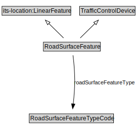

# RoadSurfaceFeature

<a href="diagrams/RoadSurfaceFeature.dot.svg">Open interactive RoadSurfaceFeature diagram</a>

## Formalization for RoadSurfaceFeature

| Property | Constraint |
|----------|------------|
| subClassOf | TrafficControlDevice |

## Other annotations

| Property | Value |
|----------|-------|
| xsd:pattern | TroPattern |

