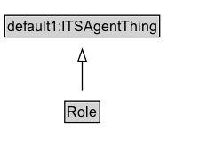

# Role

## Diagram

=== "SVG (interactive)"

    <!-- Generated by graphviz version 14.0.2 (20251019.1705)
     -->
    <!-- Pages: 1 -->
    <svg width="188pt" height="132pt"
     viewBox="0.00 0.00 188.00 132.00" xmlns="http://www.w3.org/2000/svg" xmlns:xlink="http://www.w3.org/1999/xlink">
    <g id="graph0" class="graph" transform="scale(1 1) rotate(0) translate(4 128)">
    <polygon fill="white" stroke="none" points="-4,4 -4,-128 184.38,-128 184.38,4 -4,4"/>
    <g id="clust2" class="cluster">
    <title>cluster_associated</title>
    </g>
    <!-- Role -->
    <g id="node1" class="node">
    <title>Role</title>
    <g id="a_node1"><a xlink:href="../Role" xlink:title="&lt;TABLE&gt;">
    <polygon fill="lightgray" stroke="none" points="51.62,-25.88 51.62,-42.12 79.12,-42.12 79.12,-25.88 51.62,-25.88"/>
    <text xml:space="preserve" text-anchor="start" x="52.62" y="-29.73" font-family="Arial" font-size="12.00">Role</text>
    <polygon fill="none" stroke="black" points="50.62,-24.88 50.62,-43.12 80.12,-43.12 80.12,-24.88 50.62,-24.88"/>
    </a>
    </g>
    </g>
    <!-- default1_ITSAgentThing -->
    <g id="node3" class="node">
    <title>default1_ITSAgentThing</title>
    <polygon fill="lightgray" stroke="none" points="1,-97.88 1,-114.12 129.75,-114.12 129.75,-97.88 1,-97.88"/>
    <text xml:space="preserve" text-anchor="start" x="2" y="-101.72" font-family="Arial" font-size="12.00">default1:ITSAgentThing</text>
    <polygon fill="none" stroke="black" points="0,-96.88 0,-115.12 130.75,-115.12 130.75,-96.88 0,-96.88"/>
    </g>
    <!-- Role&#45;&gt;default1_ITSAgentThing -->
    <g id="edge1" class="edge">
    <title>Role&#45;&gt;default1_ITSAgentThing</title>
    <path fill="none" stroke="black" d="M65.38,-51.79C65.38,-59.25 65.38,-68.24 65.38,-76.69"/>
    <polygon fill="none" stroke="black" points="61.88,-76.54 65.38,-86.54 68.88,-76.54 61.88,-76.54"/>
    </g>
    <!-- Invis -->
    </g>
    </svg>

=== "PNG"

    

## Specializations of Role

| Class | Description |
|-------|-------------|
| [Rule Maker Role](RuleMakerRole.md) |  |

## Formalization for Role

| Property | Constraint |
|----------|------------|
| cdm1:hasName | exactly 1 owl:Thing |
| subClassOf | default1:ITSAgentThing |

