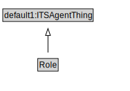

# Role

<a href="diagrams/Role.dot.svg">Open interactive Role diagram</a>

## Specializations of Role

| Class | Description |
|-------|-------------|
| [Rule Maker Role](RuleMakerRole.md) |  |

## Formalization for Role

| Property | Constraint |
|----------|------------|
| cdm1:hasName | exactly 1 owl:Thing |
| subClassOf | default1:ITSAgentThing |

