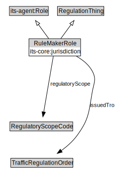

# RuleMakerRole

<a href="diagrams/RuleMakerRole.dot.svg">Open interactive RuleMakerRole diagram</a>

## Formalization for RuleMakerRole

| Property | Constraint |
|----------|------------|
| issuedTro | all cdm2:Code |
| its-core:jurisdiction | min 1 owl:Thing |
| regulatoryScope | min 1 owl:Thing |
| subClassOf | RegulationThing |
| subClassOf | default1:Role |

## Used by classes

| Class | Property |
|-------|----------|
| [Traffic Regulation Order](TrafficRegulationOrder.md) | issuingAuthority |

