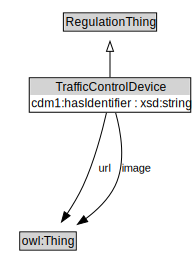

# TrafficControlDevice

<a href="diagrams/TrafficControlDevice.dot.svg">Open interactive TrafficControlDevice diagram</a>

## Specializations of TrafficControlDevice

| Class | Description |
|-------|-------------|
| [Access Control Device](AccessControlDevice.md) |  |
| [Channelization Device](ChannelizationDevice.md) |  |
| [Pavement Marking](PavementMarking.md) |  |
| [Road Sign](RoadSign.md) |  |
| [Road Surface Feature](RoadSurfaceFeature.md) |  |
| [Traffic Signal](TrafficSignal.md) |  |
| [Traffic Signal Device](TrafficSignalDevice.md) |  |
| [Warning Beacon](WarningBeacon.md) |  |

## Formalization for TrafficControlDevice

| Property | Constraint |
|----------|------------|
| subClassOf | RegulationThing |

## Used by classes

| Class | Property |
|-------|----------|
| [Traffic Regulation](TrafficRegulation.md) | associatedTrafficControlDevice |

