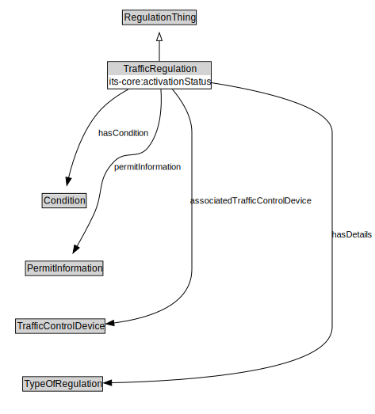

# TrafficRegulation

<a href="diagrams/TrafficRegulation.dot.svg">Open interactive TrafficRegulation diagram</a>

## Formalization for TrafficRegulation

| Property | Constraint |
|----------|------------|
| associatedTrafficControlDevice | all TrafficControlDevice |
| condition | max 1 owl:Thing |
| its-core:activationStatus | exactly 1 owl:Thing |
| permitInformation | all PermitInformation |
| subClassOf | RegulationThing |
| typeOfRegulation | min 1 owl:Thing |

