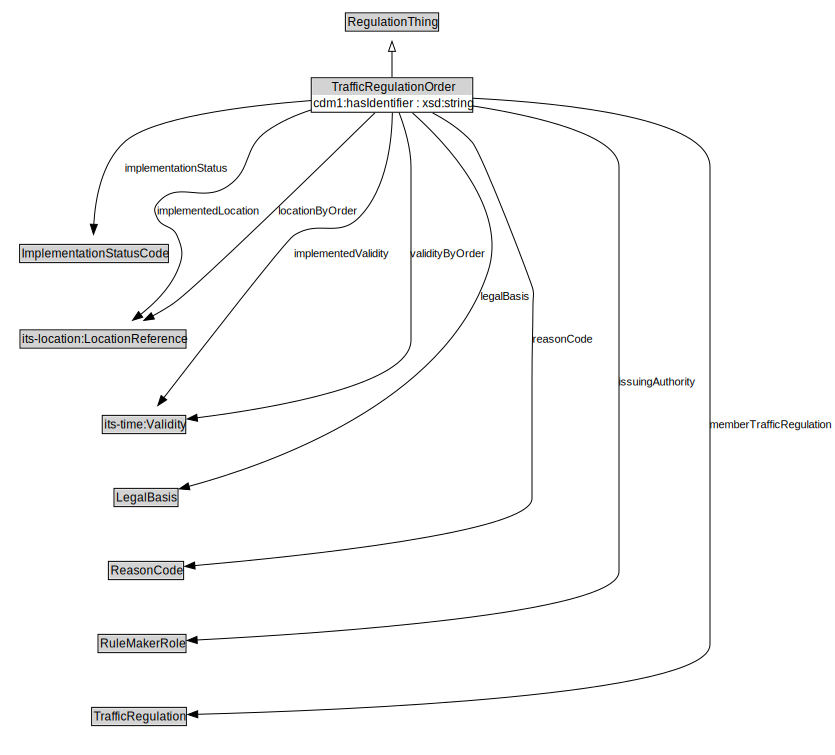

# TrafficRegulationOrder

<a href="diagrams/TrafficRegulationOrder.dot.svg">Open interactive TrafficRegulationOrder diagram</a>

## Formalization for TrafficRegulationOrder

| Property | Constraint |
|----------|------------|
| cdm1:hasDescription | all xsd:string |
| cdm1:hasDescription | max 1 owl:Thing |
| cdm1:hasIdentifier | all xsd:string |
| cdm1:hasIdentifier | exactly 1 owl:Thing |
| implementationStatus | exactly 1 owl:Thing |
| implementedLocation | max 1 owl:Thing |
| implementedValidity | max 1 owl:Thing |
| issuingAuthority | all RuleMakerRole |
| issuingAuthority | exactly 1 owl:Thing |
| legalBasis | max 1 owl:Thing |
| locationByOrder | max 1 owl:Thing |
| reasonCode | all cdm2:Code |
| subClassOf | RegulationThing |
| trafficRegulations | min 1 owl:Thing |
| troStatus | all cdm2:Code |
| validityByOrder | max 1 owl:Thing |

