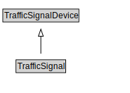

# TrafficSignal

<a href="diagrams/TrafficSignal.dot.svg">Open interactive TrafficSignal diagram</a>

## Formalization for TrafficSignal

| Property | Constraint |
|----------|------------|
| subClassOf | TrafficSignalDevice |

## Other annotations

| Property | Value |
|----------|-------|
| xsd:pattern | TroPattern |

