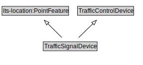

# TrafficSignalDevice

<a href="diagrams/TrafficSignalDevice.dot.svg">Open interactive TrafficSignalDevice diagram</a>

## Specializations of TrafficSignalDevice

| Class | Description |
|-------|-------------|
| [Traffic Signal](TrafficSignal.md) |  |
| [Warning Beacon](WarningBeacon.md) |  |

## Formalization for TrafficSignalDevice

| Property | Constraint |
|----------|------------|
| subClassOf | TrafficControlDevice |

## Other annotations

| Property | Value |
|----------|-------|
| xsd:pattern | TroPattern |

