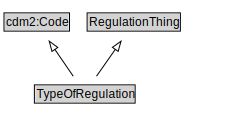

# TypeOfRegulation

<a href="diagrams/TypeOfRegulation.dot.svg">Open interactive TypeOfRegulation diagram</a>

## Formalization for TypeOfRegulation

| Property | Constraint |
|----------|------------|
| subClassOf | RegulationThing |

## Other annotations

| Property | Value |
|----------|-------|
| xsd:pattern | TroPattern |

