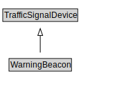

# WarningBeacon

<a href="diagrams/WarningBeacon.dot.svg">Open interactive WarningBeacon diagram</a>

## Formalization for WarningBeacon

| Property | Constraint |
|----------|------------|
| subClassOf | TrafficSignalDevice |

## Other annotations

| Property | Value |
|----------|-------|
| xsd:pattern | TroPattern |

