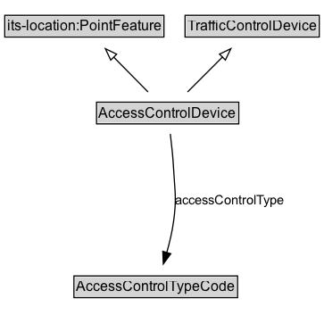

# AccessControlDevice

A device that is used to control access to a specific area, such as a gate or barrier.

## Diagram

=== "SVG (interactive)"

    <!-- Generated by graphviz version 14.1.3 (20260303.0454)
     -->
    <!-- Pages: 1 -->
    <svg width="272pt" height="279pt"
     viewBox="0.00 0.00 272.00 279.00" xmlns="http://www.w3.org/2000/svg" xmlns:xlink="http://www.w3.org/1999/xlink">
    <g id="graph0" class="graph" transform="scale(1 1) rotate(0) translate(4 275)">
    <polygon fill="white" stroke="none" points="-4,4 -4,-275 268.25,-275 268.25,4 -4,4"/>
    <g id="clust3" class="cluster">
    <title>cluster_associated</title>
    </g>
    <!-- its&#45;location_PointFeature -->
    <g id="node1" class="node">
    <title>its&#45;location_PointFeature</title>
    <g id="a_node1"><a xlink:href="https://w3id.org/itsdata/location/v1/PointFeature" xlink:title="&lt;TABLE&gt;">
    <polygon fill="lightgray" stroke="none" points="1,-244.88 1,-261.12 132.75,-261.12 132.75,-244.88 1,-244.88"/>
    <text xml:space="preserve" text-anchor="start" x="2" y="-248.88" font-family="Arial" font-size="12.00">its&#45;location:PointFeature</text>
    <polygon fill="none" stroke="black" points="0,-243.88 0,-262.12 133.75,-262.12 133.75,-243.88 0,-243.88"/>
    </a>
    </g>
    </g>
    <!-- TrafficControlDevice -->
    <g id="node2" class="node">
    <title>TrafficControlDevice</title>
    <g id="a_node2"><a xlink:href="../TrafficControlDevice" xlink:title="&lt;TABLE&gt;">
    <polygon fill="lightgray" stroke="none" points="152.5,-244.88 152.5,-261.12 263.25,-261.12 263.25,-244.88 152.5,-244.88"/>
    <text xml:space="preserve" text-anchor="start" x="153.5" y="-248.88" font-family="Arial" font-size="12.00">TrafficControlDevice</text>
    <polygon fill="none" stroke="black" points="151.5,-243.88 151.5,-262.12 264.25,-262.12 264.25,-243.88 151.5,-243.88"/>
    </a>
    </g>
    </g>
    <!-- AccessControlDevice -->
    <g id="node3" class="node">
    <title>AccessControlDevice</title>
    <g id="a_node3"><a xlink:href="../AccessControlDevice" xlink:title="&lt;TABLE&gt;">
    <polygon fill="lightgray" stroke="none" points="78.12,-171.88 78.12,-188.12 195.62,-188.12 195.62,-171.88 78.12,-171.88"/>
    <text xml:space="preserve" text-anchor="start" x="79.12" y="-175.88" font-family="Arial" font-size="12.00">AccessControlDevice</text>
    <polygon fill="none" stroke="black" points="77.12,-170.88 77.12,-189.12 196.62,-189.12 196.62,-170.88 77.12,-170.88"/>
    </a>
    </g>
    </g>
    <!-- AccessControlDevice&#45;&gt;its&#45;location_PointFeature -->
    <g id="edge1" class="edge">
    <title>AccessControlDevice&#45;&gt;its&#45;location_PointFeature</title>
    <path fill="none" stroke="black" d="M120.41,-197.71C111.79,-206.44 101.08,-217.31 91.5,-227.02"/>
    <polygon fill="none" stroke="black" points="89.06,-224.52 84.53,-234.1 94.04,-229.43 89.06,-224.52"/>
    </g>
    <!-- AccessControlDevice&#45;&gt;TrafficControlDevice -->
    <g id="edge2" class="edge">
    <title>AccessControlDevice&#45;&gt;TrafficControlDevice</title>
    <path fill="none" stroke="black" d="M153.58,-197.71C162.4,-206.53 173.4,-217.53 183.19,-227.31"/>
    <polygon fill="none" stroke="black" points="180.43,-229.51 189.98,-234.1 185.38,-224.56 180.43,-229.51"/>
    </g>
    <!-- Invis -->
    <!-- AccessControlDevice&#45;&gt;Invis -->
    <!-- AccessControlTypeCode -->
    <g id="node5" class="node">
    <title>AccessControlTypeCode</title>
    <g id="a_node5"><a xlink:href="../AccessControlTypeCode" xlink:title="&lt;TABLE&gt;">
    <polygon fill="lightgray" stroke="none" points="59.12,-25.88 59.12,-42.12 194.62,-42.12 194.62,-25.88 59.12,-25.88"/>
    <text xml:space="preserve" text-anchor="start" x="60.12" y="-29.88" font-family="Arial" font-size="12.00">AccessControlTypeCode</text>
    <polygon fill="none" stroke="black" points="58.12,-24.88 58.12,-43.12 195.62,-43.12 195.62,-24.88 58.12,-24.88"/>
    </a>
    </g>
    </g>
    <!-- AccessControlDevice&#45;&gt;AccessControlTypeCode -->
    <g id="edge5" class="edge">
    <title>AccessControlDevice&#45;&gt;AccessControlTypeCode</title>
    <path fill="none" stroke="black" d="M139.11,-162.43C140.18,-153.69 141.34,-142.79 141.88,-133 142.93,-113.47 144.52,-108.38 141.88,-89 140.68,-80.25 138.45,-70.92 136.07,-62.52"/>
    <polygon fill="black" stroke="black" points="139.5,-61.78 133.24,-53.23 132.8,-63.81 139.5,-61.78"/>
    <text xml:space="preserve" text-anchor="middle" x="189.07" y="-103.3" font-family="Arial" font-size="11.00">accessControlType</text>
    </g>
    <!-- Invis&#45;&gt;AccessControlTypeCode -->
    </g>
    </svg>

=== "PNG"

    

## Formalization for AccessControlDevice

| Property | Constraint |
|----------|------------|
| [accessControlType](../properties/accessControlType.md) | only [AccessControlTypeCode](https://w3id.org/itsdata/regulation/v1/AccessControlTypeCode) |
| subClassOf | [TrafficControlDevice](TrafficControlDevice.md) |
| subClassOf | [its-location:PointFeature](https://w3id.org/itsdata/location/v1/PointFeature) |

