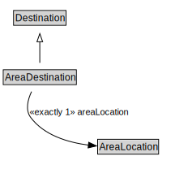

# AreaDestination

<a href="../../diagrams/AreaDestination.svg">Open interactive AreaDestination diagram</a>

## Formalization

| Property | Value Restriction | Definition |
|----------|-------------------|------------|
| areaLocation | exactly 1 [AreaLocation](AreaLocation.md) | None |
| rdfs:subClassOf | [Destination](Destination.md) | --- |

## Other Annotations

- **xsd:pattern**: [LocationPattern](LocationPattern.md)

