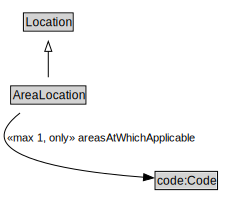

# AreaLocation

<a href="../../diagrams/AreaLocation.svg">Open interactive AreaLocation diagram</a>

## Formalization

| Property | Value Restriction | Definition |
|----------|-------------------|------------|
| areasAtWhichApplicable | max 1 code:Code | None |
| areasAtWhichApplicable | only code:Code | None |
| rdfs:subClassOf | [Location](Location.md) | --- |

## Other Annotations

- **xsd:pattern**: [LocationPattern](LocationPattern.md)

