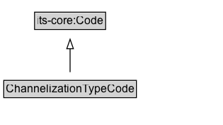

# ChannelizationTypeCode

A code that indicates the type of channelization device.

## Diagram

=== "SVG (interactive)"

    <!-- Generated by graphviz version 14.1.3 (20260303.0454)
     -->
    <!-- Pages: 1 -->
    <svg width="236pt" height="132pt"
     viewBox="0.00 0.00 236.00 132.00" xmlns="http://www.w3.org/2000/svg" xmlns:xlink="http://www.w3.org/1999/xlink">
    <g id="graph0" class="graph" transform="scale(1 1) rotate(0) translate(4 128)">
    <polygon fill="white" stroke="none" points="-4,4 -4,-128 232.25,-128 232.25,4 -4,4"/>
    <g id="clust3" class="cluster">
    <title>cluster_associated</title>
    </g>
    <!-- its&#45;core_Code -->
    <g id="node1" class="node">
    <title>its&#45;core_Code</title>
    <g id="a_node1"><a xlink:href="https://w3id.org/itsdata/core/v1/Code" xlink:title="&lt;TABLE&gt;">
    <polygon fill="lightgray" stroke="none" points="33.62,-97.88 33.62,-114.12 106.88,-114.12 106.88,-97.88 33.62,-97.88"/>
    <text xml:space="preserve" text-anchor="start" x="34.62" y="-101.88" font-family="Arial" font-size="12.00">its&#45;core:Code</text>
    <polygon fill="none" stroke="black" points="32.62,-96.88 32.62,-115.12 107.88,-115.12 107.88,-96.88 32.62,-96.88"/>
    </a>
    </g>
    </g>
    <!-- ChannelizationTypeCode -->
    <g id="node2" class="node">
    <title>ChannelizationTypeCode</title>
    <g id="a_node2"><a xlink:href="../ChannelizationTypeCode" xlink:title="&lt;TABLE&gt;">
    <polygon fill="lightgray" stroke="none" points="1,-25.88 1,-42.12 139.5,-42.12 139.5,-25.88 1,-25.88"/>
    <text xml:space="preserve" text-anchor="start" x="2" y="-29.88" font-family="Arial" font-size="12.00">ChannelizationTypeCode</text>
    <polygon fill="none" stroke="black" points="0,-24.88 0,-43.12 140.5,-43.12 140.5,-24.88 0,-24.88"/>
    </a>
    </g>
    </g>
    <!-- ChannelizationTypeCode&#45;&gt;its&#45;core_Code -->
    <g id="edge1" class="edge">
    <title>ChannelizationTypeCode&#45;&gt;its&#45;core_Code</title>
    <path fill="none" stroke="black" d="M70.25,-51.79C70.25,-59.25 70.25,-68.24 70.25,-76.69"/>
    <polygon fill="none" stroke="black" points="66.75,-76.54 70.25,-86.54 73.75,-76.54 66.75,-76.54"/>
    </g>
    <!-- Invis -->
    </g>
    </svg>

=== "PNG"

    

## Formalization for ChannelizationTypeCode

| Property | Constraint |
|----------|------------|
| subClassOf | [its-core:Code](https://w3id.org/itsdata/core/v1/Code) |

