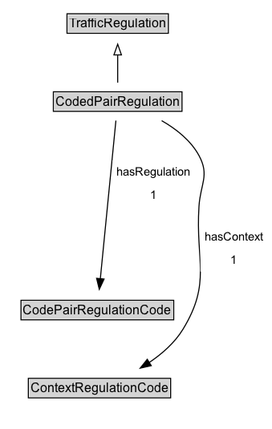

# CodedPairRegulation

A restriction defined by a code.

## Diagram

=== "SVG (interactive)"

    <!-- Generated by graphviz version 14.1.3 (20260303.0454)
     -->
    <!-- Pages: 1 -->
    <svg width="254pt" height="401pt"
     viewBox="0.00 0.00 254.00 401.00" xmlns="http://www.w3.org/2000/svg" xmlns:xlink="http://www.w3.org/1999/xlink">
    <g id="graph0" class="graph" transform="scale(1 1) rotate(0) translate(4 397)">
    <polygon fill="white" stroke="none" points="-4,4 -4,-397 250.06,-397 250.06,4 -4,4"/>
    <g id="clust3" class="cluster">
    <title>cluster_associated</title>
    </g>
    <!-- TrafficRegulation -->
    <g id="node1" class="node">
    <title>TrafficRegulation</title>
    <g id="a_node1"><a xlink:href="../TrafficRegulation" xlink:title="&lt;TABLE&gt;">
    <polygon fill="lightgray" stroke="none" points="59.62,-366.88 59.62,-383.12 152.38,-383.12 152.38,-366.88 59.62,-366.88"/>
    <text xml:space="preserve" text-anchor="start" x="60.62" y="-370.88" font-family="Arial" font-size="12.00">TrafficRegulation</text>
    <polygon fill="none" stroke="black" points="58.62,-365.88 58.62,-384.12 153.38,-384.12 153.38,-365.88 58.62,-365.88"/>
    </a>
    </g>
    </g>
    <!-- CodedPairRegulation -->
    <g id="node2" class="node">
    <title>CodedPairRegulation</title>
    <g id="a_node2"><a xlink:href="../CodedPairRegulation" xlink:title="&lt;TABLE&gt;">
    <polygon fill="lightgray" stroke="none" points="46.88,-293.88 46.88,-310.12 165.12,-310.12 165.12,-293.88 46.88,-293.88"/>
    <text xml:space="preserve" text-anchor="start" x="47.88" y="-297.88" font-family="Arial" font-size="12.00">CodedPairRegulation</text>
    <polygon fill="none" stroke="black" points="45.88,-292.88 45.88,-311.12 166.12,-311.12 166.12,-292.88 45.88,-292.88"/>
    </a>
    </g>
    </g>
    <!-- CodedPairRegulation&#45;&gt;TrafficRegulation -->
    <g id="edge1" class="edge">
    <title>CodedPairRegulation&#45;&gt;TrafficRegulation</title>
    <path fill="none" stroke="black" d="M106,-319.71C106,-327.47 106,-336.92 106,-345.74"/>
    <polygon fill="none" stroke="black" points="102.5,-345.66 106,-355.66 109.5,-345.66 102.5,-345.66"/>
    </g>
    <!-- Invis -->
    <!-- CodedPairRegulation&#45;&gt;Invis -->
    <!-- CodePairRegulationCode -->
    <g id="node4" class="node">
    <title>CodePairRegulationCode</title>
    <g id="a_node4"><a xlink:href="../CodePairRegulationCode" xlink:title="&lt;TABLE&gt;">
    <polygon fill="lightgray" stroke="none" points="16.62,-98.88 16.62,-115.12 157.38,-115.12 157.38,-98.88 16.62,-98.88"/>
    <text xml:space="preserve" text-anchor="start" x="17.62" y="-102.88" font-family="Arial" font-size="12.00">CodePairRegulationCode</text>
    <polygon fill="none" stroke="black" points="15.62,-97.88 15.62,-116.12 158.38,-116.12 158.38,-97.88 15.62,-97.88"/>
    </a>
    </g>
    </g>
    <!-- CodedPairRegulation&#45;&gt;CodePairRegulationCode -->
    <g id="edge6" class="edge">
    <title>CodedPairRegulation&#45;&gt;CodePairRegulationCode</title>
    <path fill="none" stroke="black" d="M104.35,-284.21C101.08,-251.06 93.78,-176.89 89.77,-136.14"/>
    <polygon fill="black" stroke="black" points="93.27,-136 88.81,-126.39 86.31,-136.69 93.27,-136"/>
    <polygon fill="white" stroke="none" points="101.07,-204 101.07,-247 178.07,-247 178.07,-204 101.07,-204"/>
    <text xml:space="preserve" text-anchor="start" x="105.07" y="-232.5" font-family="Arial" font-size="11.00">hasRegulation</text>
    <text xml:space="preserve" text-anchor="start" x="136.57" y="-211" font-family="Arial" font-size="11.00">1</text>
    </g>
    <!-- ContextRegulationCode -->
    <g id="node5" class="node">
    <title>ContextRegulationCode</title>
    <g id="a_node5"><a xlink:href="../ContextRegulationCode" xlink:title="&lt;TABLE&gt;">
    <polygon fill="lightgray" stroke="none" points="23.5,-25.88 23.5,-42.12 154.5,-42.12 154.5,-25.88 23.5,-25.88"/>
    <text xml:space="preserve" text-anchor="start" x="24.5" y="-29.88" font-family="Arial" font-size="12.00">ContextRegulationCode</text>
    <polygon fill="none" stroke="black" points="22.5,-24.88 22.5,-43.12 155.5,-43.12 155.5,-24.88 22.5,-24.88"/>
    </a>
    </g>
    </g>
    <!-- CodedPairRegulation&#45;&gt;ContextRegulationCode -->
    <g id="edge5" class="edge">
    <title>CodedPairRegulation&#45;&gt;ContextRegulationCode</title>
    <path fill="none" stroke="black" d="M147.11,-284.14C160.73,-276.35 174.35,-265.62 182,-251.5 192.06,-232.94 183.37,-225.07 182,-204 178.66,-152.56 193.83,-133.01 167,-89 159.36,-76.46 147.57,-66.11 135.46,-57.93"/>
    <polygon fill="black" stroke="black" points="137.37,-55 127.04,-52.65 133.65,-60.93 137.37,-55"/>
    <polygon fill="white" stroke="none" points="183.31,-143 183.31,-186 246.06,-186 246.06,-143 183.31,-143"/>
    <text xml:space="preserve" text-anchor="start" x="187.31" y="-171.5" font-family="Arial" font-size="11.00">hasContext</text>
    <text xml:space="preserve" text-anchor="start" x="211.68" y="-150" font-family="Arial" font-size="11.00">1</text>
    </g>
    <!-- Invis&#45;&gt;CodePairRegulationCode -->
    <!-- CodePairRegulationCode&#45;&gt;ContextRegulationCode -->
    </g>
    </svg>

=== "PNG"

    

## Formalization for CodedPairRegulation

| Property | Constraint |
|----------|------------|
| [hasContext](../properties/hasContext.md) | exactly 1 |
| [hasRegulation](../properties/hasRegulation.md) | exactly 1 |
| subClassOf | [TrafficRegulation](TrafficRegulation.md) |

## Other annotations

| Property | Value |
|----------|-------|
| [rdfs:seeAlso](https://w3id.org/citydata/imported/rdfs/seeAlso) | DATEX-II AlternateRoadOrCarriagewayOrLaneLayout |
| [skos:editorsNote](https://w3id.org/citydata/imported/skos/editorsNote) | The type of temporary markings and locations are defined by the associated traffic control devices. |

