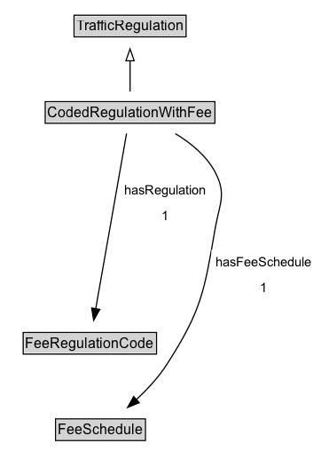

# CodedRegulationWithFee

A condition defined by a code.

## Diagram

=== "SVG (interactive)"

    <!-- Generated by graphviz version 14.1.3 (20260303.0454)
     -->
    <!-- Pages: 1 -->
    <svg width="272pt" height="401pt"
     viewBox="0.00 0.00 272.00 401.00" xmlns="http://www.w3.org/2000/svg" xmlns:xlink="http://www.w3.org/1999/xlink">
    <g id="graph0" class="graph" transform="scale(1 1) rotate(0) translate(4 397)">
    <polygon fill="white" stroke="none" points="-4,4 -4,-397 267.84,-397 267.84,4 -4,4"/>
    <g id="clust3" class="cluster">
    <title>cluster_associated</title>
    </g>
    <!-- TrafficRegulation -->
    <g id="node1" class="node">
    <title>TrafficRegulation</title>
    <g id="a_node1"><a xlink:href="../TrafficRegulation" xlink:title="&lt;TABLE&gt;">
    <polygon fill="lightgray" stroke="none" points="59.62,-366.88 59.62,-383.12 152.38,-383.12 152.38,-366.88 59.62,-366.88"/>
    <text xml:space="preserve" text-anchor="start" x="60.62" y="-370.88" font-family="Arial" font-size="12.00">TrafficRegulation</text>
    <polygon fill="none" stroke="black" points="58.62,-365.88 58.62,-384.12 153.38,-384.12 153.38,-365.88 58.62,-365.88"/>
    </a>
    </g>
    </g>
    <!-- CodedRegulationWithFee -->
    <g id="node2" class="node">
    <title>CodedRegulationWithFee</title>
    <g id="a_node2"><a xlink:href="../CodedRegulationWithFee" xlink:title="&lt;TABLE&gt;">
    <polygon fill="lightgray" stroke="none" points="35.25,-293.88 35.25,-310.12 176.75,-310.12 176.75,-293.88 35.25,-293.88"/>
    <text xml:space="preserve" text-anchor="start" x="36.25" y="-297.88" font-family="Arial" font-size="12.00">CodedRegulationWithFee</text>
    <polygon fill="none" stroke="black" points="34.25,-292.88 34.25,-311.12 177.75,-311.12 177.75,-292.88 34.25,-292.88"/>
    </a>
    </g>
    </g>
    <!-- CodedRegulationWithFee&#45;&gt;TrafficRegulation -->
    <g id="edge1" class="edge">
    <title>CodedRegulationWithFee&#45;&gt;TrafficRegulation</title>
    <path fill="none" stroke="black" d="M106,-319.71C106,-327.47 106,-336.92 106,-345.74"/>
    <polygon fill="none" stroke="black" points="102.5,-345.66 106,-355.66 109.5,-345.66 102.5,-345.66"/>
    </g>
    <!-- Invis -->
    <!-- CodedRegulationWithFee&#45;&gt;Invis -->
    <!-- FeeRegulationCode -->
    <g id="node4" class="node">
    <title>FeeRegulationCode</title>
    <g id="a_node4"><a xlink:href="../FeeRegulationCode" xlink:title="&lt;TABLE&gt;">
    <polygon fill="lightgray" stroke="none" points="16.62,-98.88 16.62,-115.12 127.38,-115.12 127.38,-98.88 16.62,-98.88"/>
    <text xml:space="preserve" text-anchor="start" x="17.62" y="-102.88" font-family="Arial" font-size="12.00">FeeRegulationCode</text>
    <polygon fill="none" stroke="black" points="15.62,-97.88 15.62,-116.12 128.38,-116.12 128.38,-97.88 15.62,-97.88"/>
    </a>
    </g>
    </g>
    <!-- CodedRegulationWithFee&#45;&gt;FeeRegulationCode -->
    <g id="edge5" class="edge">
    <title>CodedRegulationWithFee&#45;&gt;FeeRegulationCode</title>
    <path fill="none" stroke="black" d="M103.04,-284.21C97.2,-251.06 84.14,-176.89 76.96,-136.14"/>
    <polygon fill="black" stroke="black" points="80.42,-135.62 75.24,-126.38 73.53,-136.83 80.42,-135.62"/>
    <polygon fill="white" stroke="none" points="97.19,-204 97.19,-247 174.19,-247 174.19,-204 97.19,-204"/>
    <text xml:space="preserve" text-anchor="start" x="101.19" y="-232.5" font-family="Arial" font-size="11.00">hasRegulation</text>
    <text xml:space="preserve" text-anchor="start" x="132.69" y="-211" font-family="Arial" font-size="11.00">1</text>
    </g>
    <!-- FeeSchedule -->
    <g id="node5" class="node">
    <title>FeeSchedule</title>
    <g id="a_node5"><a xlink:href="../FeeSchedule" xlink:title="&lt;TABLE&gt;">
    <polygon fill="lightgray" stroke="none" points="44,-25.88 44,-42.12 118,-42.12 118,-25.88 44,-25.88"/>
    <text xml:space="preserve" text-anchor="start" x="45" y="-29.88" font-family="Arial" font-size="12.00">FeeSchedule</text>
    <polygon fill="none" stroke="black" points="43,-24.88 43,-43.12 119,-43.12 119,-24.88 43,-24.88"/>
    </a>
    </g>
    </g>
    <!-- CodedRegulationWithFee&#45;&gt;FeeSchedule -->
    <g id="edge6" class="edge">
    <title>CodedRegulationWithFee&#45;&gt;FeeSchedule</title>
    <path fill="none" stroke="black" d="M144.24,-284.14C157.4,-276.25 170.66,-265.46 178,-251.5 187.83,-232.82 181.6,-224.8 178,-204 168.75,-150.53 166.42,-134.59 137,-89 129.99,-78.14 120.4,-67.85 111.13,-59.23"/>
    <polygon fill="black" stroke="black" points="113.72,-56.85 103.92,-52.81 109.07,-62.08 113.72,-56.85"/>
    <polygon fill="white" stroke="none" points="174.84,-143 174.84,-186 263.84,-186 263.84,-143 174.84,-143"/>
    <text xml:space="preserve" text-anchor="start" x="178.84" y="-171.5" font-family="Arial" font-size="11.00">hasFeeSchedule</text>
    <text xml:space="preserve" text-anchor="start" x="216.34" y="-150" font-family="Arial" font-size="11.00">1</text>
    </g>
    <!-- Invis&#45;&gt;FeeRegulationCode -->
    <!-- FeeRegulationCode&#45;&gt;FeeSchedule -->
    </g>
    </svg>

=== "PNG"

    

## Formalization for CodedRegulationWithFee

| Property | Constraint |
|----------|------------|
| hasFeeSchedule | exactly 1 |
| hasRegulation | exactly 1 |
| subClassOf | [TrafficRegulation](TrafficRegulation.md) |

## Other annotations

| Property | Value |
|----------|-------|
| [rdfs:seeAlso](https://w3id.org/citydata/imported/rdfs/seeAlso) | DATEX-II StandingOrParkingControl (for fees) |

