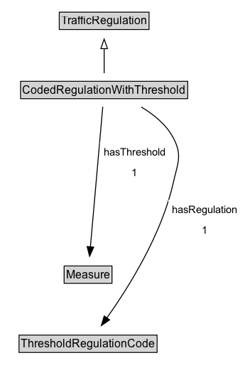

# CodedRegulationWithThreshold

A restriction defined by a code coupled with a threshold value.

## Diagram

=== "SVG (interactive)"

    <!-- Generated by graphviz version 14.1.3 (20260303.0454)
     -->
    <!-- Pages: 1 -->
    <svg width="259pt" height="401pt"
     viewBox="0.00 0.00 259.00 401.00" xmlns="http://www.w3.org/2000/svg" xmlns:xlink="http://www.w3.org/1999/xlink">
    <g id="graph0" class="graph" transform="scale(1 1) rotate(0) translate(4 397)">
    <polygon fill="white" stroke="none" points="-4,4 -4,-397 254.84,-397 254.84,4 -4,4"/>
    <g id="clust3" class="cluster">
    <title>cluster_associated</title>
    </g>
    <!-- TrafficRegulation -->
    <g id="node1" class="node">
    <title>TrafficRegulation</title>
    <g id="a_node1"><a xlink:href="../TrafficRegulation" xlink:title="&lt;TABLE&gt;">
    <polygon fill="lightgray" stroke="none" points="59.62,-366.88 59.62,-383.12 152.38,-383.12 152.38,-366.88 59.62,-366.88"/>
    <text xml:space="preserve" text-anchor="start" x="60.62" y="-370.88" font-family="Arial" font-size="12.00">TrafficRegulation</text>
    <polygon fill="none" stroke="black" points="58.62,-365.88 58.62,-384.12 153.38,-384.12 153.38,-365.88 58.62,-365.88"/>
    </a>
    </g>
    </g>
    <!-- CodedRegulationWithThreshold -->
    <g id="node2" class="node">
    <title>CodedRegulationWithThreshold</title>
    <g id="a_node2"><a xlink:href="../CodedRegulationWithThreshold" xlink:title="&lt;TABLE&gt;">
    <polygon fill="lightgray" stroke="none" points="18.75,-293.88 18.75,-310.12 193.25,-310.12 193.25,-293.88 18.75,-293.88"/>
    <text xml:space="preserve" text-anchor="start" x="19.75" y="-297.88" font-family="Arial" font-size="12.00">CodedRegulationWithThreshold</text>
    <polygon fill="none" stroke="black" points="17.75,-292.88 17.75,-311.12 194.25,-311.12 194.25,-292.88 17.75,-292.88"/>
    </a>
    </g>
    </g>
    <!-- CodedRegulationWithThreshold&#45;&gt;TrafficRegulation -->
    <g id="edge1" class="edge">
    <title>CodedRegulationWithThreshold&#45;&gt;TrafficRegulation</title>
    <path fill="none" stroke="black" d="M106,-319.71C106,-327.47 106,-336.92 106,-345.74"/>
    <polygon fill="none" stroke="black" points="102.5,-345.66 106,-355.66 109.5,-345.66 102.5,-345.66"/>
    </g>
    <!-- Invis -->
    <!-- CodedRegulationWithThreshold&#45;&gt;Invis -->
    <!-- Measure -->
    <g id="node4" class="node">
    <title>Measure</title>
    <g id="a_node4"><a xlink:href="../Measure" xlink:title="&lt;TABLE&gt;">
    <polygon fill="lightgray" stroke="none" points="64.75,-98.88 64.75,-115.12 113.25,-115.12 113.25,-98.88 64.75,-98.88"/>
    <text xml:space="preserve" text-anchor="start" x="65.75" y="-102.88" font-family="Arial" font-size="12.00">Measure</text>
    <polygon fill="none" stroke="black" points="63.75,-97.88 63.75,-116.12 114.25,-116.12 114.25,-97.88 63.75,-97.88"/>
    </a>
    </g>
    </g>
    <!-- CodedRegulationWithThreshold&#45;&gt;Measure -->
    <g id="edge6" class="edge">
    <title>CodedRegulationWithThreshold&#45;&gt;Measure</title>
    <path fill="none" stroke="black" d="M104.52,-284.21C101.6,-251.06 95.07,-176.89 91.48,-136.14"/>
    <polygon fill="black" stroke="black" points="94.98,-136.05 90.62,-126.4 88.01,-136.66 94.98,-136.05"/>
    <polygon fill="white" stroke="none" points="101.59,-204 101.59,-247 174.84,-247 174.84,-204 101.59,-204"/>
    <text xml:space="preserve" text-anchor="start" x="105.59" y="-232.5" font-family="Arial" font-size="11.00">hasThreshold</text>
    <text xml:space="preserve" text-anchor="start" x="135.22" y="-211" font-family="Arial" font-size="11.00">1</text>
    </g>
    <!-- ThresholdRegulationCode -->
    <g id="node5" class="node">
    <title>ThresholdRegulationCode</title>
    <g id="a_node5"><a xlink:href="../ThresholdRegulationCode" xlink:title="&lt;TABLE&gt;">
    <polygon fill="lightgray" stroke="none" points="17.12,-25.88 17.12,-42.12 160.88,-42.12 160.88,-25.88 17.12,-25.88"/>
    <text xml:space="preserve" text-anchor="start" x="18.12" y="-29.88" font-family="Arial" font-size="12.00">ThresholdRegulationCode</text>
    <polygon fill="none" stroke="black" points="16.12,-24.88 16.12,-43.12 161.88,-43.12 161.88,-24.88 16.12,-24.88"/>
    </a>
    </g>
    </g>
    <!-- CodedRegulationWithThreshold&#45;&gt;ThresholdRegulationCode -->
    <g id="edge5" class="edge">
    <title>CodedRegulationWithThreshold&#45;&gt;ThresholdRegulationCode</title>
    <path fill="none" stroke="black" d="M145.14,-284.02C158.35,-276.17 171.61,-265.43 179,-251.5 188.89,-232.85 183.6,-224.6 179,-204 166.73,-149.02 131.27,-92.77 108.69,-61.03"/>
    <polygon fill="black" stroke="black" points="111.73,-59.26 103.03,-53.22 106.07,-63.37 111.73,-59.26"/>
    <polygon fill="white" stroke="none" points="173.84,-143 173.84,-186 250.84,-186 250.84,-143 173.84,-143"/>
    <text xml:space="preserve" text-anchor="start" x="177.84" y="-171.5" font-family="Arial" font-size="11.00">hasRegulation</text>
    <text xml:space="preserve" text-anchor="start" x="209.34" y="-150" font-family="Arial" font-size="11.00">1</text>
    </g>
    <!-- Invis&#45;&gt;Measure -->
    <!-- Measure&#45;&gt;ThresholdRegulationCode -->
    </g>
    </svg>

=== "PNG"

    

## Formalization for CodedRegulationWithThreshold

| Property | Constraint |
|----------|------------|
| hasRegulation | exactly 1 |
| hasThreshold | exactly 1 |
| subClassOf | [TrafficRegulation](TrafficRegulation.md) |

## Other annotations

| Property | Value |
|----------|-------|
| [rdfs:seeAlso](https://w3id.org/citydata/imported/rdfs/seeAlso) | DATEX-II MinimumDistanceRestriction, NumericalSpeedValue, StandingOrParkingControl (for durations), SteepHill |

