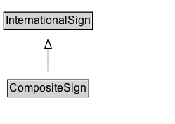

# CompositeSign

A single traffic-control unit whose content is an ordered sequence of one or more SimpleSigns, represented as an rdf:List: rdf:first is the main sign, and each rdf:rest step is the next panel in order (for example supplemental signs).

## Diagram

=== "SVG (interactive)"

    <!-- Generated by graphviz version 14.1.3 (20260303.0454)
     -->
    <!-- Pages: 1 -->
    <svg width="186pt" height="132pt"
     viewBox="0.00 0.00 186.00 132.00" xmlns="http://www.w3.org/2000/svg" xmlns:xlink="http://www.w3.org/1999/xlink">
    <g id="graph0" class="graph" transform="scale(1 1) rotate(0) translate(4 128)">
    <polygon fill="white" stroke="none" points="-4,4 -4,-128 182.38,-128 182.38,4 -4,4"/>
    <g id="clust3" class="cluster">
    <title>cluster_associated</title>
    </g>
    <!-- InternationalSign -->
    <g id="node1" class="node">
    <title>InternationalSign</title>
    <g id="a_node1"><a xlink:href="../InternationalSign" xlink:title="&lt;TABLE&gt;">
    <polygon fill="lightgray" stroke="none" points="1,-97.88 1,-114.12 93.75,-114.12 93.75,-97.88 1,-97.88"/>
    <text xml:space="preserve" text-anchor="start" x="2" y="-101.88" font-family="Arial" font-size="12.00">InternationalSign</text>
    <polygon fill="none" stroke="black" points="0,-96.88 0,-115.12 94.75,-115.12 94.75,-96.88 0,-96.88"/>
    </a>
    </g>
    </g>
    <!-- CompositeSign -->
    <g id="node2" class="node">
    <title>CompositeSign</title>
    <g id="a_node2"><a xlink:href="../CompositeSign" xlink:title="&lt;TABLE&gt;">
    <polygon fill="lightgray" stroke="none" points="5.12,-25.88 5.12,-42.12 89.62,-42.12 89.62,-25.88 5.12,-25.88"/>
    <text xml:space="preserve" text-anchor="start" x="6.12" y="-29.88" font-family="Arial" font-size="12.00">CompositeSign</text>
    <polygon fill="none" stroke="black" points="4.12,-24.88 4.12,-43.12 90.62,-43.12 90.62,-24.88 4.12,-24.88"/>
    </a>
    </g>
    </g>
    <!-- CompositeSign&#45;&gt;InternationalSign -->
    <g id="edge1" class="edge">
    <title>CompositeSign&#45;&gt;InternationalSign</title>
    <path fill="none" stroke="black" d="M47.38,-51.79C47.38,-59.25 47.38,-68.24 47.38,-76.69"/>
    <polygon fill="none" stroke="black" points="43.88,-76.54 47.38,-86.54 50.88,-76.54 43.88,-76.54"/>
    </g>
    <!-- Invis -->
    </g>
    </svg>

=== "PNG"

    

## Formalization for CompositeSign

| Property | Constraint |
|----------|------------|
| subClassOf | [InternationalSign](InternationalSign.md) |

