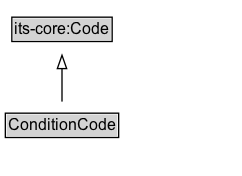

# ConditionCode

A code that indicates the enumerated types of conditions that affect the applicability of a regulation.

## Diagram

=== "SVG (interactive)"

    <!-- Generated by graphviz version 14.1.3 (20260303.0454)
     -->
    <!-- Pages: 1 -->
    <svg width="182pt" height="132pt"
     viewBox="0.00 0.00 182.00 132.00" xmlns="http://www.w3.org/2000/svg" xmlns:xlink="http://www.w3.org/1999/xlink">
    <g id="graph0" class="graph" transform="scale(1 1) rotate(0) translate(4 128)">
    <polygon fill="white" stroke="none" points="-4,4 -4,-128 177.5,-128 177.5,4 -4,4"/>
    <g id="clust3" class="cluster">
    <title>cluster_associated</title>
    </g>
    <!-- its&#45;core_Code -->
    <g id="node1" class="node">
    <title>its&#45;core_Code</title>
    <g id="a_node1"><a xlink:href="https://w3id.org/itsdata/core/v1/Code" xlink:title="&lt;TABLE&gt;">
    <polygon fill="lightgray" stroke="none" points="5.88,-97.88 5.88,-114.12 79.12,-114.12 79.12,-97.88 5.88,-97.88"/>
    <text xml:space="preserve" text-anchor="start" x="6.88" y="-101.88" font-family="Arial" font-size="12.00">its&#45;core:Code</text>
    <polygon fill="none" stroke="black" points="4.88,-96.88 4.88,-115.12 80.12,-115.12 80.12,-96.88 4.88,-96.88"/>
    </a>
    </g>
    </g>
    <!-- ConditionCode -->
    <g id="node2" class="node">
    <title>ConditionCode</title>
    <g id="a_node2"><a xlink:href="../ConditionCode" xlink:title="&lt;TABLE&gt;">
    <polygon fill="lightgray" stroke="none" points="1,-25.88 1,-42.12 84,-42.12 84,-25.88 1,-25.88"/>
    <text xml:space="preserve" text-anchor="start" x="2" y="-29.88" font-family="Arial" font-size="12.00">ConditionCode</text>
    <polygon fill="none" stroke="black" points="0,-24.88 0,-43.12 85,-43.12 85,-24.88 0,-24.88"/>
    </a>
    </g>
    </g>
    <!-- ConditionCode&#45;&gt;its&#45;core_Code -->
    <g id="edge1" class="edge">
    <title>ConditionCode&#45;&gt;its&#45;core_Code</title>
    <path fill="none" stroke="black" d="M42.5,-51.79C42.5,-59.25 42.5,-68.24 42.5,-76.69"/>
    <polygon fill="none" stroke="black" points="39,-76.54 42.5,-86.54 46,-76.54 39,-76.54"/>
    </g>
    <!-- Invis -->
    </g>
    </svg>

=== "PNG"

    

## Specializations of ConditionCode

| Class | Description |
|-------|-------------|
| [Access Category Code](AccessCategoryCode.md) | A code that indicates categories of access to a location that can affect the applicability of a regulation. |
| [Driver Category Code](DriverCategoryCode.md) | A code that indicates categories of drivers that can affect the applicability of a regulation. |
| [Emission Level Code](https://w3id.org/itsdata/vehicle/v1/EmissionLevelCode)[^alignment] |  |
| [Fuel Type Code](https://w3id.org/itsdata/vehicle/v1/FuelTypeCode)[^alignment] |  |
| [Goods Type Code](https://w3id.org/itsdata/vehicle/v1/GoodsTypeCode)[^alignment] |  |
| [Load Type Code](https://w3id.org/itsdata/vehicle/v1/LoadTypeCode)[^alignment] |  |
| [Non Vehicular Road User Code](NonVehicularRoadUserCode.md) | A code that indicates categories of non-vehicular road users that can affect the applicability of a regulation. |
| [Road Type Code](RoadTypeCode.md) | A code that indicates categories of roads that can affect the applicability of a regulation. |
| [Road Weather Condition Code](https://w3id.org/itsdata/weather/v1/RoadWeatherConditionCode)[^alignment] |  |
| [Standing Or Parking Category Code](StandingOrParkingCategoryCode.md) | A code that indicates categories of standing or parking that can affect the applicability of a regulation. |
| [Tunnel Category Code](TunnelCategoryCode.md) | A code that indicates categories of tunnels that can affect the applicability of a regulation. |
| [Vehicle Equipment Code](https://w3id.org/itsdata/vehicle/v1/VehicleEquipmentCode)[^alignment] |  |
| [Vehicle Type Code](https://w3id.org/itsdata/vehicle/v1/VehicleTypeCode)[^alignment] |  |
| [Vehicle Usage Code](https://w3id.org/itsdata/vehicle/v1/VehicleUsageCode)[^alignment] |  |

[^alignment]: Specialization asserted by this ontology via alignment; the class is defined in an external ontology and is not declared as a specialization of this class there.

## Formalization for ConditionCode

| Property | Constraint |
|----------|------------|
| subClassOf | [its-core:Code](https://w3id.org/itsdata/core/v1/Code) |

## Other annotations

| Property | Value |
|----------|-------|
| [dash:abstract](https://w3id.org/citydata/imported/dash/abstract) | true |

