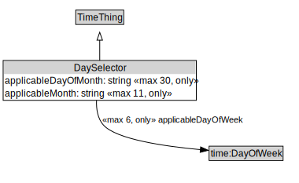

# DaySelector

<a href="../../diagrams/DaySelector.svg">Open interactive DaySelector diagram</a>

## Formalization

| Property | Value Restriction | Definition |
|----------|-------------------|------------|
| applicableDayOfMonth | max 30 xsd:gDay | None |
| applicableDayOfMonth | only xsd:gDay | None |
| applicableDayOfWeek | max 6 time:DayOfWeek | None |
| applicableDayOfWeek | only time:DayOfWeek | None |
| applicableMonth | max 11 xsd:gMonth | None |
| applicableMonth | only xsd:gMonth | None |
| rdfs:subClassOf | [TimeThing](TimeThing.md) | --- |

## Other Annotations

- **xsd:pattern**: [TimePattern](TimePattern.md)

