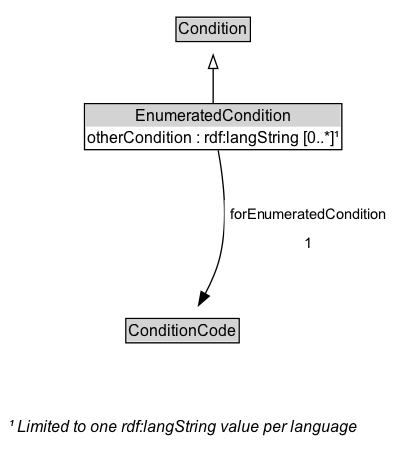

# EnumeratedCondition

A condition that is based on an enumerated value in a known code list.

## Diagram

=== "SVG (interactive)"

    <!-- Generated by graphviz version 14.1.3 (20260303.0454)
     -->
    <!-- Pages: 1 -->
    <svg width="298pt" height="343pt"
     viewBox="0.00 0.00 298.00 343.00" xmlns="http://www.w3.org/2000/svg" xmlns:xlink="http://www.w3.org/1999/xlink">
    <g id="graph0" class="graph" transform="scale(1 1) rotate(0) translate(4 339)">
    <polygon fill="white" stroke="none" points="-4,4 -4,-339 294.16,-339 294.16,4 -4,4"/>
    <g id="clust3" class="cluster">
    <title>cluster_associated</title>
    </g>
    <!-- Condition -->
    <g id="node1" class="node">
    <title>Condition</title>
    <g id="a_node1"><a xlink:href="../Condition" xlink:title="&lt;TABLE&gt;">
    <polygon fill="lightgray" stroke="none" points="129,-308.88 129,-325.12 182.75,-325.12 182.75,-308.88 129,-308.88"/>
    <text xml:space="preserve" text-anchor="start" x="130" y="-312.88" font-family="Arial" font-size="12.00">Condition</text>
    <polygon fill="none" stroke="black" points="128,-307.88 128,-326.12 183.75,-326.12 183.75,-307.88 128,-307.88"/>
    </a>
    </g>
    </g>
    <!-- EnumeratedCondition -->
    <g id="node2" class="node">
    <title>EnumeratedCondition</title>
    <g id="a_node2"><a xlink:href="../EnumeratedCondition" xlink:title="&lt;TABLE&gt;">
    <polygon fill="lightgray" stroke="none" points="60.38,-244 60.38,-260.25 251.38,-260.25 251.38,-244 60.38,-244"/>
    <text xml:space="preserve" text-anchor="start" x="97.38" y="-248" font-family="Arial" font-size="12.00">EnumeratedCondition</text>
    <text xml:space="preserve" text-anchor="start" x="61.38" y="-231.75" font-family="Arial" font-size="12.00">otherCondition : rdf:langString [0..&#42;]¹</text>
    <polygon fill="none" stroke="black" points="59.38,-226.75 59.38,-261.25 252.38,-261.25 252.38,-226.75 59.38,-226.75"/>
    </a>
    </g>
    </g>
    <!-- EnumeratedCondition&#45;&gt;Condition -->
    <g id="edge1" class="edge">
    <title>EnumeratedCondition&#45;&gt;Condition</title>
    <path fill="none" stroke="black" d="M155.88,-261.71C155.88,-269.47 155.88,-278.92 155.88,-287.74"/>
    <polygon fill="none" stroke="black" points="152.38,-287.66 155.88,-297.66 159.38,-287.66 152.38,-287.66"/>
    </g>
    <!-- Invis -->
    <!-- EnumeratedCondition&#45;&gt;Invis -->
    <!-- ConditionCode -->
    <g id="node4" class="node">
    <title>ConditionCode</title>
    <g id="a_node4"><a xlink:href="../ConditionCode" xlink:title="&lt;TABLE&gt;">
    <polygon fill="lightgray" stroke="none" points="91.38,-82.88 91.38,-99.12 174.38,-99.12 174.38,-82.88 91.38,-82.88"/>
    <text xml:space="preserve" text-anchor="start" x="92.38" y="-86.88" font-family="Arial" font-size="12.00">ConditionCode</text>
    <polygon fill="none" stroke="black" points="90.38,-81.88 90.38,-100.12 175.38,-100.12 175.38,-81.88 90.38,-81.88"/>
    </a>
    </g>
    </g>
    <!-- EnumeratedCondition&#45;&gt;ConditionCode -->
    <g id="edge4" class="edge">
    <title>EnumeratedCondition&#45;&gt;ConditionCode</title>
    <path fill="none" stroke="black" d="M159.62,-226.25C163.34,-206.7 167.59,-173.52 160.88,-146 158.59,-136.62 154.36,-127.06 149.88,-118.63"/>
    <polygon fill="black" stroke="black" points="152.94,-116.93 144.93,-109.99 146.86,-120.41 152.94,-116.93"/>
    <polygon fill="white" stroke="none" points="164.41,-146 164.41,-189 290.16,-189 290.16,-146 164.41,-146"/>
    <text xml:space="preserve" text-anchor="start" x="168.41" y="-174.5" font-family="Arial" font-size="11.00">forEnumeratedCondition</text>
    <text xml:space="preserve" text-anchor="start" x="224.28" y="-153" font-family="Arial" font-size="11.00">1</text>
    </g>
    <!-- Invis&#45;&gt;ConditionCode -->
    <!-- EnumeratedCondition_uniqueLang_note -->
    <g id="node5" class="node">
    <title>EnumeratedCondition_uniqueLang_note</title>
    <text xml:space="preserve" text-anchor="start" x="2" y="-14.72" font-family="Arial" font-style="italic" font-size="12.00">¹ Limited to one rdf:langString value per language</text>
    </g>
    <!-- ConditionCode&#45;&gt;EnumeratedCondition_uniqueLang_note -->
    </g>
    </svg>

=== "PNG"

    

## Formalization for EnumeratedCondition

| Property | Constraint |
|----------|------------|
| [forEnumeratedCondition](../properties/forEnumeratedCondition.md) | exactly 1 |
| [forEnumeratedCondition](../properties/forEnumeratedCondition.md) | only [ConditionCode](https://w3id.org/itsdata/regulation/v1/ConditionCode) |
| [otherCondition](../properties/otherCondition.md) | 0..* rdf:langString (one per language) |
| subClassOf | [Condition](Condition.md) |

