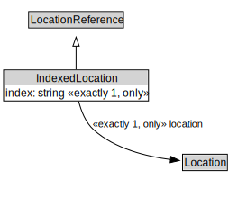

# IndexedLocation

<a href="../../diagrams/IndexedLocation.svg">Open interactive IndexedLocation diagram</a>

## Formalization

| Property | Value Restriction | Definition |
|----------|-------------------|------------|
| index | exactly 1 xsd:integer | None |
| index | only xsd:integer | None |
| location | exactly 1 [Location](Location.md) | None |
| location | only [Location](Location.md) | None |
| rdfs:subClassOf | [LocationReference](LocationReference.md) | --- |

## Other Annotations

- **xsd:pattern**: [LocationPattern](LocationPattern.md)

