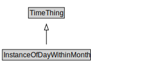

# InstanceOfDayWithinMonth

<a href="../../diagrams/InstanceOfDayWithinMonth.svg">Open interactive InstanceOfDayWithinMonth diagram</a>

## Formalization

| Property | Value Restriction | Definition |
|----------|-------------------|------------|
| rdfs:subClassOf | [TimeThing](TimeThing.md) | --- |

## Other Annotations

- **xsd:pattern**: [TimePattern](TimePattern.md)

