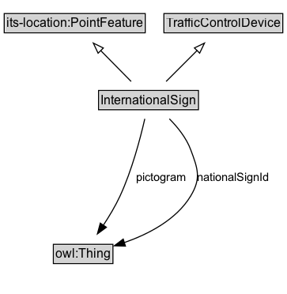

# InternationalSign

A traffic control device that is used to convey information to road users, such as regulatory, warning, or guide signs.

## Diagram

=== "SVG (interactive)"

    <!-- Generated by graphviz version 14.1.3 (20260303.0454)
     -->
    <!-- Pages: 1 -->
    <svg width="272pt" height="279pt"
     viewBox="0.00 0.00 272.00 279.00" xmlns="http://www.w3.org/2000/svg" xmlns:xlink="http://www.w3.org/1999/xlink">
    <g id="graph0" class="graph" transform="scale(1 1) rotate(0) translate(4 275)">
    <polygon fill="white" stroke="none" points="-4,4 -4,-275 268.25,-275 268.25,4 -4,4"/>
    <g id="clust3" class="cluster">
    <title>cluster_associated</title>
    </g>
    <!-- its&#45;location_PointFeature -->
    <g id="node1" class="node">
    <title>its&#45;location_PointFeature</title>
    <g id="a_node1"><a xlink:href="https://w3id.org/itsdata/location/v1/PointFeature" xlink:title="&lt;TABLE&gt;">
    <polygon fill="lightgray" stroke="none" points="1,-244.88 1,-261.12 132.75,-261.12 132.75,-244.88 1,-244.88"/>
    <text xml:space="preserve" text-anchor="start" x="2" y="-248.88" font-family="Arial" font-size="12.00">its&#45;location:PointFeature</text>
    <polygon fill="none" stroke="black" points="0,-243.88 0,-262.12 133.75,-262.12 133.75,-243.88 0,-243.88"/>
    </a>
    </g>
    </g>
    <!-- TrafficControlDevice -->
    <g id="node2" class="node">
    <title>TrafficControlDevice</title>
    <g id="a_node2"><a xlink:href="../TrafficControlDevice" xlink:title="&lt;TABLE&gt;">
    <polygon fill="lightgray" stroke="none" points="152.5,-244.88 152.5,-261.12 263.25,-261.12 263.25,-244.88 152.5,-244.88"/>
    <text xml:space="preserve" text-anchor="start" x="153.5" y="-248.88" font-family="Arial" font-size="12.00">TrafficControlDevice</text>
    <polygon fill="none" stroke="black" points="151.5,-243.88 151.5,-262.12 264.25,-262.12 264.25,-243.88 151.5,-243.88"/>
    </a>
    </g>
    </g>
    <!-- InternationalSign -->
    <g id="node3" class="node">
    <title>InternationalSign</title>
    <g id="a_node3"><a xlink:href="../InternationalSign" xlink:title="&lt;TABLE&gt;">
    <polygon fill="lightgray" stroke="none" points="90.5,-171.88 90.5,-188.12 183.25,-188.12 183.25,-171.88 90.5,-171.88"/>
    <text xml:space="preserve" text-anchor="start" x="91.5" y="-175.88" font-family="Arial" font-size="12.00">InternationalSign</text>
    <polygon fill="none" stroke="black" points="89.5,-170.88 89.5,-189.12 184.25,-189.12 184.25,-170.88 89.5,-170.88"/>
    </a>
    </g>
    </g>
    <!-- InternationalSign&#45;&gt;its&#45;location_PointFeature -->
    <g id="edge1" class="edge">
    <title>InternationalSign&#45;&gt;its&#45;location_PointFeature</title>
    <path fill="none" stroke="black" d="M120.41,-197.71C111.79,-206.44 101.08,-217.31 91.5,-227.02"/>
    <polygon fill="none" stroke="black" points="89.06,-224.52 84.53,-234.1 94.04,-229.43 89.06,-224.52"/>
    </g>
    <!-- InternationalSign&#45;&gt;TrafficControlDevice -->
    <g id="edge2" class="edge">
    <title>InternationalSign&#45;&gt;TrafficControlDevice</title>
    <path fill="none" stroke="black" d="M153.58,-197.71C162.4,-206.53 173.4,-217.53 183.19,-227.31"/>
    <polygon fill="none" stroke="black" points="180.43,-229.51 189.98,-234.1 185.38,-224.56 180.43,-229.51"/>
    </g>
    <!-- Invis -->
    <!-- InternationalSign&#45;&gt;Invis -->
    <!-- owl_Thing -->
    <g id="node5" class="node">
    <title>owl_Thing</title>
    <g id="a_node5"><a xlink:href="https://w3id.org/citydata/imported/owl/latest/Thing" xlink:title="&lt;TABLE&gt;">
    <polygon fill="lightgray" stroke="none" points="47.62,-25.88 47.62,-42.12 102.12,-42.12 102.12,-25.88 47.62,-25.88"/>
    <text xml:space="preserve" text-anchor="start" x="48.62" y="-29.88" font-family="Arial" font-size="12.00">owl:Thing</text>
    <polygon fill="none" stroke="black" points="46.62,-24.88 46.62,-43.12 103.12,-43.12 103.12,-24.88 46.62,-24.88"/>
    </a>
    </g>
    </g>
    <!-- InternationalSign&#45;&gt;owl_Thing -->
    <g id="edge5" class="edge">
    <title>InternationalSign&#45;&gt;owl_Thing</title>
    <path fill="none" stroke="black" d="M133.35,-162.23C129.13,-143.76 121.18,-113.43 109.88,-89 105.49,-79.53 99.65,-69.77 93.99,-61.21"/>
    <polygon fill="black" stroke="black" points="96.93,-59.31 88.39,-53.04 91.15,-63.26 96.93,-59.31"/>
    <text xml:space="preserve" text-anchor="middle" x="149.08" y="-103.3" font-family="Arial" font-size="11.00">pictogram</text>
    </g>
    <!-- InternationalSign&#45;&gt;owl_Thing -->
    <g id="edge6" class="edge">
    <title>InternationalSign&#45;&gt;owl_Thing</title>
    <path fill="none" stroke="black" d="M156.66,-162.25C164.55,-154.29 172.72,-144.1 176.88,-133 183.72,-114.68 186.96,-105.75 176.88,-89 163.2,-66.28 136.4,-52.62 113.71,-44.72"/>
    <polygon fill="black" stroke="black" points="115,-41.46 104.41,-41.76 112.87,-48.13 115,-41.46"/>
    <text xml:space="preserve" text-anchor="middle" x="217.41" y="-103.3" font-family="Arial" font-size="11.00">nationalSignId</text>
    </g>
    <!-- Invis&#45;&gt;owl_Thing -->
    </g>
    </svg>

=== "PNG"

    

## Specializations of InternationalSign

| Class | Description |
|-------|-------------|
| [Composite Sign](CompositeSign.md) | A single traffic-control unit whose content is an ordered sequence of one or more SimpleSigns, represented as an rdf:List: rdf:first is the main sign, and each rdf:rest step is the next panel in order (for example supplemental signs). |
| [Simple Sign](SimpleSign.md) | A traffic control device that consists of a single message conveyed by a single pictogram. |

## Formalization for InternationalSign

| Property | Constraint |
|----------|------------|
| [nationalSignId](../properties/nationalSignId.md) | datatype xsd:string |
| [pictogram](../properties/pictogram.md) | datatype its-core:oidstring |
| subClassOf | [TrafficControlDevice](TrafficControlDevice.md) |
| subClassOf | [its-location:PointFeature](https://w3id.org/itsdata/location/v1/PointFeature) |

## Other annotations

| Property | Value |
|----------|-------|
| [dash:abstract](https://w3id.org/citydata/imported/dash/abstract) | true |

