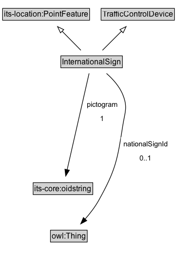

# InternationalSign

A traffic control device that is used to convey information to road users, such as regulatory, warning, or guide signs.

## Diagram

=== "SVG (interactive)"

    <!-- Generated by graphviz version 14.1.3 (20260303.0454)
     -->
    <!-- Pages: 1 -->
    <svg width="272pt" height="401pt"
     viewBox="0.00 0.00 272.00 401.00" xmlns="http://www.w3.org/2000/svg" xmlns:xlink="http://www.w3.org/1999/xlink">
    <g id="graph0" class="graph" transform="scale(1 1) rotate(0) translate(4 397)">
    <polygon fill="white" stroke="none" points="-4,4 -4,-397 268.25,-397 268.25,4 -4,4"/>
    <g id="clust3" class="cluster">
    <title>cluster_associated</title>
    </g>
    <!-- its&#45;location_PointFeature -->
    <g id="node1" class="node">
    <title>its&#45;location_PointFeature</title>
    <g id="a_node1"><a xlink:href="https://w3id.org/itsdata/location/v1/PointFeature" xlink:title="&lt;TABLE&gt;">
    <polygon fill="lightgray" stroke="none" points="1,-366.88 1,-383.12 132.75,-383.12 132.75,-366.88 1,-366.88"/>
    <text xml:space="preserve" text-anchor="start" x="2" y="-370.88" font-family="Arial" font-size="12.00">its&#45;location:PointFeature</text>
    <polygon fill="none" stroke="black" points="0,-365.88 0,-384.12 133.75,-384.12 133.75,-365.88 0,-365.88"/>
    </a>
    </g>
    </g>
    <!-- TrafficControlDevice -->
    <g id="node2" class="node">
    <title>TrafficControlDevice</title>
    <g id="a_node2"><a xlink:href="../TrafficControlDevice" xlink:title="&lt;TABLE&gt;">
    <polygon fill="lightgray" stroke="none" points="152.5,-366.88 152.5,-383.12 263.25,-383.12 263.25,-366.88 152.5,-366.88"/>
    <text xml:space="preserve" text-anchor="start" x="153.5" y="-370.88" font-family="Arial" font-size="12.00">TrafficControlDevice</text>
    <polygon fill="none" stroke="black" points="151.5,-365.88 151.5,-384.12 264.25,-384.12 264.25,-365.88 151.5,-365.88"/>
    </a>
    </g>
    </g>
    <!-- InternationalSign -->
    <g id="node3" class="node">
    <title>InternationalSign</title>
    <g id="a_node3"><a xlink:href="../InternationalSign" xlink:title="&lt;TABLE&gt;">
    <polygon fill="lightgray" stroke="none" points="90.5,-293.88 90.5,-310.12 183.25,-310.12 183.25,-293.88 90.5,-293.88"/>
    <text xml:space="preserve" text-anchor="start" x="91.5" y="-297.88" font-family="Arial" font-size="12.00">InternationalSign</text>
    <polygon fill="none" stroke="black" points="89.5,-292.88 89.5,-311.12 184.25,-311.12 184.25,-292.88 89.5,-292.88"/>
    </a>
    </g>
    </g>
    <!-- InternationalSign&#45;&gt;its&#45;location_PointFeature -->
    <g id="edge1" class="edge">
    <title>InternationalSign&#45;&gt;its&#45;location_PointFeature</title>
    <path fill="none" stroke="black" d="M120.41,-319.71C111.79,-328.44 101.08,-339.31 91.5,-349.02"/>
    <polygon fill="none" stroke="black" points="89.06,-346.52 84.53,-356.1 94.04,-351.43 89.06,-346.52"/>
    </g>
    <!-- InternationalSign&#45;&gt;TrafficControlDevice -->
    <g id="edge2" class="edge">
    <title>InternationalSign&#45;&gt;TrafficControlDevice</title>
    <path fill="none" stroke="black" d="M153.58,-319.71C162.4,-328.53 173.4,-339.53 183.19,-349.31"/>
    <polygon fill="none" stroke="black" points="180.43,-351.51 189.98,-356.1 185.38,-346.56 180.43,-351.51"/>
    </g>
    <!-- Invis -->
    <!-- InternationalSign&#45;&gt;Invis -->
    <!-- its&#45;core_oidstring -->
    <g id="node5" class="node">
    <title>its&#45;core_oidstring</title>
    <g id="a_node5"><a xlink:href="https://w3id.org/itsdata/core/v1/oidstring" xlink:title="&lt;TABLE&gt;">
    <polygon fill="lightgray" stroke="none" points="48,-98.88 48,-115.12 137.75,-115.12 137.75,-98.88 48,-98.88"/>
    <text xml:space="preserve" text-anchor="start" x="49" y="-102.88" font-family="Arial" font-size="12.00">its&#45;core:oidstring</text>
    <polygon fill="none" stroke="black" points="47,-97.88 47,-116.12 138.75,-116.12 138.75,-97.88 47,-97.88"/>
    </a>
    </g>
    </g>
    <!-- InternationalSign&#45;&gt;its&#45;core_oidstring -->
    <g id="edge6" class="edge">
    <title>InternationalSign&#45;&gt;its&#45;core_oidstring</title>
    <path fill="none" stroke="black" d="M133.05,-284.21C125.47,-250.99 108.51,-176.57 99.23,-135.88"/>
    <polygon fill="black" stroke="black" points="102.7,-135.34 97.06,-126.36 95.87,-136.89 102.7,-135.34"/>
    <polygon fill="white" stroke="none" points="125.47,-204 125.47,-247 180.72,-247 180.72,-204 125.47,-204"/>
    <text xml:space="preserve" text-anchor="start" x="129.47" y="-232.5" font-family="Arial" font-size="11.00">pictogram</text>
    <text xml:space="preserve" text-anchor="start" x="150.09" y="-211" font-family="Arial" font-size="11.00">1</text>
    </g>
    <!-- owl_Thing -->
    <g id="node6" class="node">
    <title>owl_Thing</title>
    <g id="a_node6"><a xlink:href="https://w3id.org/citydata/imported/owl/latest/Thing" xlink:title="&lt;TABLE&gt;">
    <polygon fill="lightgray" stroke="none" points="74.62,-25.88 74.62,-42.12 129.12,-42.12 129.12,-25.88 74.62,-25.88"/>
    <text xml:space="preserve" text-anchor="start" x="75.62" y="-29.88" font-family="Arial" font-size="12.00">owl:Thing</text>
    <polygon fill="none" stroke="black" points="73.62,-24.88 73.62,-43.12 130.12,-43.12 130.12,-24.88 73.62,-24.88"/>
    </a>
    </g>
    </g>
    <!-- InternationalSign&#45;&gt;owl_Thing -->
    <g id="edge7" class="edge">
    <title>InternationalSign&#45;&gt;owl_Thing</title>
    <path fill="none" stroke="black" d="M159.81,-284.1C169.49,-275.54 179.7,-264.26 184.88,-251.5 192.8,-231.93 188.15,-224.86 184.88,-204 176.55,-150.96 174.01,-135.9 147.88,-89 142.18,-78.78 134.38,-68.71 126.81,-60.08"/>
    <polygon fill="black" stroke="black" points="129.47,-57.81 120.14,-52.79 124.31,-62.53 129.47,-57.81"/>
    <polygon fill="white" stroke="none" points="181.84,-143 181.84,-186 258.09,-186 258.09,-143 181.84,-143"/>
    <text xml:space="preserve" text-anchor="start" x="185.84" y="-171.5" font-family="Arial" font-size="11.00">nationalSignId</text>
    <text xml:space="preserve" text-anchor="start" x="210.97" y="-150" font-family="Arial" font-size="11.00">0..1</text>
    </g>
    <!-- Invis&#45;&gt;its&#45;core_oidstring -->
    <!-- its&#45;core_oidstring&#45;&gt;owl_Thing -->
    </g>
    </svg>

=== "PNG"

    

## Specializations of InternationalSign

| Class | Description |
|-------|-------------|
| [Composite Sign](CompositeSign.md) | A single traffic-control unit whose content is an ordered sequence of one or more SimpleSigns, represented as an rdf:List: rdf:first is the main sign, and each rdf:rest step is the next panel in order (for example supplemental signs). |
| [Simple Sign](SimpleSign.md) | A traffic control device that consists of a single message conveyed by a single pictogram. |

## Formalization for InternationalSign

| Property | Constraint |
|----------|------------|
| [nationalSignId](../properties/nationalSignId.md) | max 1 xsd:string |
| [pictogram](../properties/pictogram.md) | exactly 1 its-core:oidstring |
| subClassOf | [TrafficControlDevice](TrafficControlDevice.md) |
| subClassOf | [its-location:PointFeature](https://w3id.org/itsdata/location/v1/PointFeature) |

## Other annotations

| Property | Value |
|----------|-------|
| [dash:abstract](https://w3id.org/citydata/imported/dash/abstract) | true |

