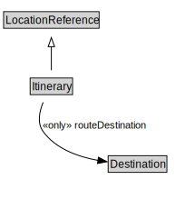

# Itinerary

<a href="../../diagrams/Itinerary.svg">Open interactive Itinerary diagram</a>

## Formalization

| Property | Value Restriction | Definition |
|----------|-------------------|------------|
| rdfs:subClassOf | [LocationReference](LocationReference.md) | --- |
| routeDestination | only [Destination](Destination.md) | None |

## Other Annotations

- **xsd:pattern**: [LocationPattern](LocationPattern.md)

