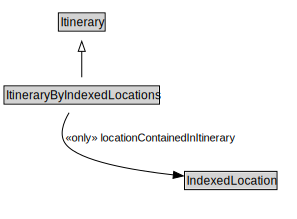

# ItineraryByIndexedLocations

<a href="../../diagrams/ItineraryByIndexedLocations.svg">Open interactive ItineraryByIndexedLocations diagram</a>

## Formalization

| Property | Value Restriction | Definition |
|----------|-------------------|------------|
| locationContainedInItinerary | only [IndexedLocation](IndexedLocation.md) | None |
| rdfs:subClassOf | [Itinerary](Itinerary.md) | --- |

## Other Annotations

- **xsd:pattern**: [LocationPattern](LocationPattern.md)

