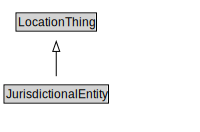

# JurisdictionalEntity

<a href="../../diagrams/JurisdictionalEntity.svg">Open interactive JurisdictionalEntity diagram</a>

## Formalization

| Property | Value Restriction | Definition |
|----------|-------------------|------------|
| rdfs:subClassOf | [LocationThing](LocationThing.md) | --- |

## Other Annotations

- **xsd:pattern**: [LocationPattern](LocationPattern.md)

