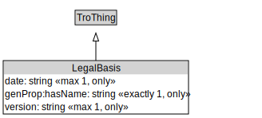

# LegalBasis

A legal basis provides references to the legal documents that authorize an entity to issue the types of regulations covered by a traffic regulation order.

<a href="../../diagrams/LegalBasis.svg">Open interactive LegalBasis diagram</a>

## Formalization for LegalBasis

| Property | Value Restriction | Definition |
|----------|-------------------|------------|
| date | max 1 xsd::date | None |
| date | only xsd::date | None |
| genProp::hasName | exactly 1 xsd::string | None |
| genProp::hasName | only xsd::string | None |
| rdfs:subClassOf | [TroThing](TroThing.md) | --- |
| version | max 1 xsd::string | None |
| version | only xsd::string | None |

## LegalBasis Is Used By

- [TrafficRegulationOrder](TrafficRegulationOrder.md).legalBasis

## Other Annotations

- **xsd::pattern**: TroPattern

