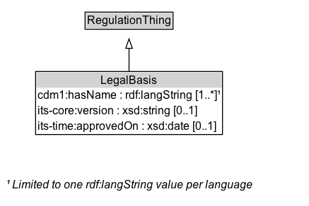

# LegalBasis

A legal basis provides references to the legal documents that authorize an entity to issue the types of regulations covered by a traffic regulation order.

## Diagram

=== "SVG (interactive)"

    <!-- Generated by graphviz version 14.1.3 (20260303.0454)
     -->
    <!-- Pages: 1 -->
    <svg width="328pt" height="219pt"
     viewBox="0.00 0.00 328.00 219.00" xmlns="http://www.w3.org/2000/svg" xmlns:xlink="http://www.w3.org/1999/xlink">
    <g id="graph0" class="graph" transform="scale(1 1) rotate(0) translate(4 215)">
    <polygon fill="white" stroke="none" points="-4,4 -4,-215 323.88,-215 323.88,4 -4,4"/>
    <g id="clust3" class="cluster">
    <title>cluster_associated</title>
    </g>
    <!-- RegulationThing -->
    <g id="node1" class="node">
    <title>RegulationThing</title>
    <g id="a_node1"><a xlink:href="../RegulationThing" xlink:title="&lt;TABLE&gt;">
    <polygon fill="lightgray" stroke="none" points="87.25,-184.88 87.25,-201.12 178.5,-201.12 178.5,-184.88 87.25,-184.88"/>
    <text xml:space="preserve" text-anchor="start" x="88.25" y="-188.88" font-family="Arial" font-size="12.00">RegulationThing</text>
    <polygon fill="none" stroke="black" points="86.25,-183.88 86.25,-202.12 179.5,-202.12 179.5,-183.88 86.25,-183.88"/>
    </a>
    </g>
    </g>
    <!-- LegalBasis -->
    <g id="node2" class="node">
    <title>LegalBasis</title>
    <g id="a_node2"><a xlink:href="../LegalBasis" xlink:title="&lt;TABLE&gt;">
    <polygon fill="lightgray" stroke="none" points="34.75,-121.75 34.75,-138 231,-138 231,-121.75 34.75,-121.75"/>
    <text xml:space="preserve" text-anchor="start" x="102.88" y="-125.75" font-family="Arial" font-size="12.00">LegalBasis</text>
    <text xml:space="preserve" text-anchor="start" x="35.75" y="-109.5" font-family="Arial" font-size="12.00">cdm1:hasName : rdf:langString [1..&#42;]¹</text>
    <text xml:space="preserve" text-anchor="start" x="35.75" y="-93.25" font-family="Arial" font-size="12.00">its&#45;core:version : xsd:string [0..1]</text>
    <text xml:space="preserve" text-anchor="start" x="35.75" y="-77" font-family="Arial" font-size="12.00">its&#45;time:approvedOn : xsd:date [0..1]</text>
    <polygon fill="none" stroke="black" points="33.75,-72 33.75,-139 232,-139 232,-72 33.75,-72"/>
    </a>
    </g>
    </g>
    <!-- LegalBasis&#45;&gt;RegulationThing -->
    <g id="edge1" class="edge">
    <title>LegalBasis&#45;&gt;RegulationThing</title>
    <path fill="none" stroke="black" d="M132.88,-138.93C132.88,-147.12 132.88,-155.83 132.88,-163.79"/>
    <polygon fill="none" stroke="black" points="129.38,-163.59 132.88,-173.59 136.38,-163.59 129.38,-163.59"/>
    </g>
    <!-- LegalBasis_uniqueLang_note -->
    <g id="node4" class="node">
    <title>LegalBasis_uniqueLang_note</title>
    <text xml:space="preserve" text-anchor="start" x="2" y="-14.72" font-family="Arial" font-style="italic" font-size="12.00">¹ Limited to one rdf:langString value per language</text>
    </g>
    <!-- LegalBasis&#45;&gt;LegalBasis_uniqueLang_note -->
    <!-- Invis -->
    </g>
    </svg>

=== "PNG"

    

## Formalization for LegalBasis

| Property | Constraint |
|----------|------------|
| [cdm1:hasName](https://w3id.org/citydata/part1/v1/hasName) | min 1 rdf:langString |
| [its-core:version](https://w3id.org/itsdata/core/v1/version) | max 1 xsd:string |
| [its-time:approvedOn](https://w3id.org/itsdata/time/v1/approvedOn) | max 1 xsd:date |
| subClassOf | [RegulationThing](RegulationThing.md) |

