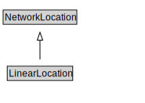

# LinearLocation

<a href="../../diagrams/LinearLocation.svg">Open interactive LinearLocation diagram</a>

## Formalization

| Property | Value Restriction | Definition |
|----------|-------------------|------------|
| rdfs:subClassOf | [NetworkLocation](NetworkLocation.md) | --- |

## Other Annotations

- **xsd:pattern**: [LocationPattern](LocationPattern.md)

