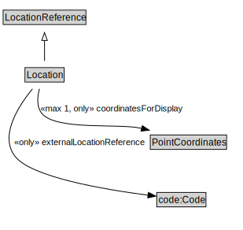

# Location

<a href="../../diagrams/Location.svg">Open interactive Location diagram</a>

## Formalization

| Property | Value Restriction | Definition |
|----------|-------------------|------------|
| coordinatesForDisplay | max 1 [PointCoordinates](PointCoordinates.md) | None |
| coordinatesForDisplay | only [PointCoordinates](PointCoordinates.md) | None |
| externalLocationReference | only code:Code | None |
| rdfs:subClassOf | [LocationReference](LocationReference.md) | --- |

## Other Annotations

- **xsd:pattern**: [LocationPattern](LocationPattern.md)

