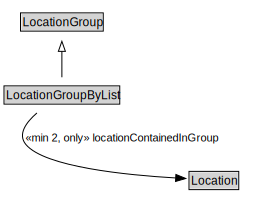

# LocationGroupByList

<a href="../../diagrams/LocationGroupByList.svg">Open interactive LocationGroupByList diagram</a>

## Formalization

| Property | Value Restriction | Definition |
|----------|-------------------|------------|
| locationContainedInGroup | min 2 [Location](Location.md) | None |
| locationContainedInGroup | only [Location](Location.md) | None |
| rdfs:subClassOf | [LocationGroup](LocationGroup.md) | --- |

## Other Annotations

- **xsd:pattern**: [LocationPattern](LocationPattern.md)

