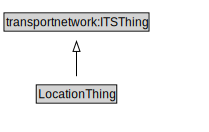

# LocationThing

<a href="../../diagrams/LocationThing.svg">Open interactive LocationThing diagram</a>

## Formalization

| Property | Value Restriction | Definition |
|----------|-------------------|------------|
| rdfs:subClassOf | transportnetwork:ITSThing | --- |

## Other Annotations

- **xsd:pattern**: [LocationPattern](LocationPattern.md)

