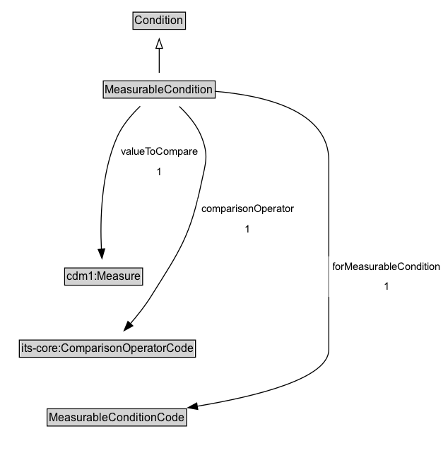

# MeasurableCondition

A condition that is based on a comparison between a measurable value and a threshold value.

## Diagram

=== "SVG (interactive)"

    <!-- Generated by graphviz version 14.1.3 (20260303.0454)
     -->
    <!-- Pages: 1 -->
    <svg width="476pt" height="481pt"
     viewBox="0.00 0.00 476.00 481.00" xmlns="http://www.w3.org/2000/svg" xmlns:xlink="http://www.w3.org/1999/xlink">
    <g id="graph0" class="graph" transform="scale(1 1) rotate(0) translate(4 477)">
    <polygon fill="white" stroke="none" points="-4,4 -4,-477 471.75,-477 471.75,4 -4,4"/>
    <g id="clust3" class="cluster">
    <title>cluster_associated</title>
    </g>
    <!-- Condition -->
    <g id="node1" class="node">
    <title>Condition</title>
    <g id="a_node1"><a xlink:href="../Condition" xlink:title="&lt;TABLE&gt;">
    <polygon fill="lightgray" stroke="none" points="138.12,-446.88 138.12,-463.12 191.88,-463.12 191.88,-446.88 138.12,-446.88"/>
    <text xml:space="preserve" text-anchor="start" x="139.12" y="-450.88" font-family="Arial" font-size="12.00">Condition</text>
    <polygon fill="none" stroke="black" points="137.12,-445.88 137.12,-464.12 192.88,-464.12 192.88,-445.88 137.12,-445.88"/>
    </a>
    </g>
    </g>
    <!-- MeasurableCondition -->
    <g id="node2" class="node">
    <title>MeasurableCondition</title>
    <g id="a_node2"><a xlink:href="../MeasurableCondition" xlink:title="&lt;TABLE&gt;">
    <polygon fill="lightgray" stroke="none" points="106.62,-373.88 106.62,-390.12 223.38,-390.12 223.38,-373.88 106.62,-373.88"/>
    <text xml:space="preserve" text-anchor="start" x="107.62" y="-377.88" font-family="Arial" font-size="12.00">MeasurableCondition</text>
    <polygon fill="none" stroke="black" points="105.62,-372.88 105.62,-391.12 224.38,-391.12 224.38,-372.88 105.62,-372.88"/>
    </a>
    </g>
    </g>
    <!-- MeasurableCondition&#45;&gt;Condition -->
    <g id="edge1" class="edge">
    <title>MeasurableCondition&#45;&gt;Condition</title>
    <path fill="none" stroke="black" d="M165,-399.71C165,-407.47 165,-416.92 165,-425.74"/>
    <polygon fill="none" stroke="black" points="161.5,-425.66 165,-435.66 168.5,-425.66 161.5,-425.66"/>
    </g>
    <!-- Invis -->
    <!-- MeasurableCondition&#45;&gt;Invis -->
    <!-- cdm1_Measure -->
    <g id="node4" class="node">
    <title>cdm1_Measure</title>
    <g id="a_node4"><a xlink:href="https://w3id.org/citydata/part1/v1/Measure" xlink:title="&lt;TABLE&gt;">
    <polygon fill="lightgray" stroke="none" points="65.62,-175.38 65.62,-191.62 146.38,-191.62 146.38,-175.38 65.62,-175.38"/>
    <text xml:space="preserve" text-anchor="start" x="66.62" y="-179.38" font-family="Arial" font-size="12.00">cdm1:Measure</text>
    <polygon fill="none" stroke="black" points="64.62,-174.38 64.62,-192.62 147.38,-192.62 147.38,-174.38 64.62,-174.38"/>
    </a>
    </g>
    </g>
    <!-- MeasurableCondition&#45;&gt;cdm1_Measure -->
    <g id="edge8" class="edge">
    <title>MeasurableCondition&#45;&gt;cdm1_Measure</title>
    <path fill="none" stroke="black" d="M144.82,-364.26C135.71,-355.5 125.77,-344.01 120.25,-331.5 103.23,-292.95 102.19,-243.31 103.63,-212.71"/>
    <polygon fill="black" stroke="black" points="107.12,-212.93 104.23,-202.73 100.13,-212.5 107.12,-212.93"/>
    <polygon fill="white" stroke="none" points="120.25,-284 120.25,-327 210,-327 210,-284 120.25,-284"/>
    <text xml:space="preserve" text-anchor="start" x="124.25" y="-312.5" font-family="Arial" font-size="11.00">valueToCompare</text>
    <text xml:space="preserve" text-anchor="start" x="162.12" y="-291" font-family="Arial" font-size="11.00">1</text>
    </g>
    <!-- its&#45;core_ComparisonOperatorCode -->
    <g id="node5" class="node">
    <title>its&#45;core_ComparisonOperatorCode</title>
    <g id="a_node5"><a xlink:href="https://w3id.org/itsdata/core/v1/ComparisonOperatorCode" xlink:title="&lt;TABLE&gt;">
    <polygon fill="lightgray" stroke="none" points="17.5,-98.88 17.5,-115.12 202.5,-115.12 202.5,-98.88 17.5,-98.88"/>
    <text xml:space="preserve" text-anchor="start" x="18.5" y="-102.88" font-family="Arial" font-size="12.00">its&#45;core:ComparisonOperatorCode</text>
    <polygon fill="none" stroke="black" points="16.5,-97.88 16.5,-116.12 203.5,-116.12 203.5,-97.88 16.5,-97.88"/>
    </a>
    </g>
    </g>
    <!-- MeasurableCondition&#45;&gt;its&#45;core_ComparisonOperatorCode -->
    <g id="edge7" class="edge">
    <title>MeasurableCondition&#45;&gt;its&#45;core_ComparisonOperatorCode</title>
    <path fill="none" stroke="black" d="M186.3,-364.05C195.45,-355.41 205.14,-344.07 210,-331.5 217.61,-311.81 214.37,-304.65 210,-284 197.73,-225.99 187.55,-212.2 156,-162 149.77,-152.09 141.83,-142.1 134.31,-133.46"/>
    <polygon fill="black" stroke="black" points="137,-131.22 127.72,-126.12 131.8,-135.9 137,-131.22"/>
    <polygon fill="white" stroke="none" points="205.8,-223 205.8,-266 312.05,-266 312.05,-223 205.8,-223"/>
    <text xml:space="preserve" text-anchor="start" x="209.8" y="-251.5" font-family="Arial" font-size="11.00">comparisonOperator</text>
    <text xml:space="preserve" text-anchor="start" x="255.93" y="-230" font-family="Arial" font-size="11.00">1</text>
    </g>
    <!-- MeasurableConditionCode -->
    <g id="node6" class="node">
    <title>MeasurableConditionCode</title>
    <g id="a_node6"><a xlink:href="../MeasurableConditionCode" xlink:title="&lt;TABLE&gt;">
    <polygon fill="lightgray" stroke="none" points="47,-25.88 47,-42.12 193,-42.12 193,-25.88 47,-25.88"/>
    <text xml:space="preserve" text-anchor="start" x="48" y="-29.88" font-family="Arial" font-size="12.00">MeasurableConditionCode</text>
    <polygon fill="none" stroke="black" points="46,-24.88 46,-43.12 194,-43.12 194,-24.88 46,-24.88"/>
    </a>
    </g>
    </g>
    <!-- MeasurableCondition&#45;&gt;MeasurableConditionCode -->
    <g id="edge6" class="edge">
    <title>MeasurableCondition&#45;&gt;MeasurableConditionCode</title>
    <path fill="none" stroke="black" d="M223.94,-380.1C276.43,-375.79 345,-359.94 345,-306.5 345,-306.5 345,-306.5 345,-106 345,-75.52 268.97,-56.49 205.3,-45.89"/>
    <polygon fill="black" stroke="black" points="205.91,-42.44 195.48,-44.31 204.8,-49.35 205.91,-42.44"/>
    <polygon fill="white" stroke="none" points="345,-162 345,-205 467.75,-205 467.75,-162 345,-162"/>
    <text xml:space="preserve" text-anchor="start" x="349" y="-190.5" font-family="Arial" font-size="11.00">forMeasurableCondition</text>
    <text xml:space="preserve" text-anchor="start" x="403.38" y="-169" font-family="Arial" font-size="11.00">1</text>
    </g>
    <!-- Invis&#45;&gt;cdm1_Measure -->
    <!-- cdm1_Measure&#45;&gt;its&#45;core_ComparisonOperatorCode -->
    <!-- its&#45;core_ComparisonOperatorCode&#45;&gt;MeasurableConditionCode -->
    </g>
    </svg>

=== "PNG"

    

## Formalization for MeasurableCondition

| Property | Constraint |
|----------|------------|
| [comparisonOperator](../properties/comparisonOperator.md) | exactly 1 |
| [comparisonOperator](../properties/comparisonOperator.md) | exactly 1 [its-core:ComparisonOperatorCode](https://w3id.org/itsdata/core/v1/ComparisonOperatorCode) |
| [forMeasurableCondition](../properties/forMeasurableCondition.md) | exactly 1 |
| [forMeasurableCondition](../properties/forMeasurableCondition.md) | exactly 1 [MeasurableConditionCode](https://w3id.org/itsdata/regulation/v1/MeasurableConditionCode) |
| [valueToCompare](../properties/valueToCompare.md) | exactly 1 |
| [valueToCompare](../properties/valueToCompare.md) | exactly 1 [cdm1:Measure](https://w3id.org/citydata/part1/v1/Measure) |
| subClassOf | [Condition](Condition.md) |

