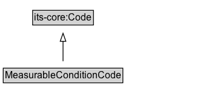

# MeasurableConditionCode

A code that indicates the type of measurable condition that is assessed, including both the type of measure and the type of entity being measured.

EXAMPLE: vehicle gross weight, vehicle height, vehicle speed, wind speed, number of occupants, driver age, time driver's license held, etc.

## Diagram

=== "SVG (interactive)"

    <!-- Generated by graphviz version 14.1.3 (20260303.0454)
     -->
    <!-- Pages: 1 -->
    <svg width="244pt" height="132pt"
     viewBox="0.00 0.00 244.00 132.00" xmlns="http://www.w3.org/2000/svg" xmlns:xlink="http://www.w3.org/1999/xlink">
    <g id="graph0" class="graph" transform="scale(1 1) rotate(0) translate(4 128)">
    <polygon fill="white" stroke="none" points="-4,4 -4,-128 240,-128 240,4 -4,4"/>
    <g id="clust3" class="cluster">
    <title>cluster_associated</title>
    </g>
    <!-- its&#45;core_Code -->
    <g id="node1" class="node">
    <title>its&#45;core_Code</title>
    <g id="a_node1"><a xlink:href="https://w3id.org/itsdata/core/v1/Code" xlink:title="&lt;TABLE&gt;">
    <polygon fill="lightgray" stroke="none" points="37.38,-97.88 37.38,-114.12 110.62,-114.12 110.62,-97.88 37.38,-97.88"/>
    <text xml:space="preserve" text-anchor="start" x="38.38" y="-101.88" font-family="Arial" font-size="12.00">its&#45;core:Code</text>
    <polygon fill="none" stroke="black" points="36.38,-96.88 36.38,-115.12 111.62,-115.12 111.62,-96.88 36.38,-96.88"/>
    </a>
    </g>
    </g>
    <!-- MeasurableConditionCode -->
    <g id="node2" class="node">
    <title>MeasurableConditionCode</title>
    <g id="a_node2"><a xlink:href="../MeasurableConditionCode" xlink:title="&lt;TABLE&gt;">
    <polygon fill="lightgray" stroke="none" points="1,-25.88 1,-42.12 147,-42.12 147,-25.88 1,-25.88"/>
    <text xml:space="preserve" text-anchor="start" x="2" y="-29.88" font-family="Arial" font-size="12.00">MeasurableConditionCode</text>
    <polygon fill="none" stroke="black" points="0,-24.88 0,-43.12 148,-43.12 148,-24.88 0,-24.88"/>
    </a>
    </g>
    </g>
    <!-- MeasurableConditionCode&#45;&gt;its&#45;core_Code -->
    <g id="edge1" class="edge">
    <title>MeasurableConditionCode&#45;&gt;its&#45;core_Code</title>
    <path fill="none" stroke="black" d="M74,-51.79C74,-59.25 74,-68.24 74,-76.69"/>
    <polygon fill="none" stroke="black" points="70.5,-76.54 74,-86.54 77.5,-76.54 70.5,-76.54"/>
    </g>
    <!-- Invis -->
    </g>
    </svg>

=== "PNG"

    

## Formalization for MeasurableConditionCode

| Property | Constraint |
|----------|------------|
| subClassOf | [its-core:Code](https://w3id.org/itsdata/core/v1/Code) |

## Other annotations

| Property | Value |
|----------|-------|
| [rdfs:seeAlso](https://w3id.org/citydata/imported/rdfs/seeAlso) | DATEX-II WeightCharacteristic, HeightCharacteristic, LengthCharacteristic, WidthCharacteristic, HeaviestAxleWeightCharacteristic, NumberOfAxelsCharacteristic, OccupantCondition. |

