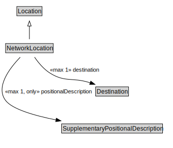

# NetworkLocation

<a href="../../diagrams/NetworkLocation.svg">Open interactive NetworkLocation diagram</a>

## Formalization

| Property | Value Restriction | Definition |
|----------|-------------------|------------|
| destination | max 1 [Destination](Destination.md) | None |
| positionalDescription | max 1 [SupplementaryPositionalDescription](SupplementaryPositionalDescription.md) | None |
| positionalDescription | only [SupplementaryPositionalDescription](SupplementaryPositionalDescription.md) | None |
| rdfs:subClassOf | [Location](Location.md) | --- |

## Other Annotations

- **xsd:pattern**: [LocationPattern](LocationPattern.md)

